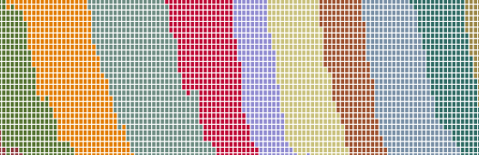

---
output:
  md_document:
    variant: markdown_github
---

```{r eval=FALSE, include=FALSE}

---
output:
  md_document:
    variant: markdown_github
---

---
title: "American politcal data and R"
author: "Jason Timm, PhD"
output:
  html_document:
    toc: true
    toc_float: true
---

url: [jtimm.net](https://www.jtimm.net/) | git: [jaytimm](https://github.com/jaytimm) | twitter: [DrJayTimm](https://twitter.com/DrJayTimm)

<br>
```


```{r setup, include=FALSE}
knitr::opts_chunk$set(echo = TRUE)
source("/home/jtimm/jt_work/GitHub/git_projects/render_toc.R")
```


# American political data & R

`r paste0('*Updated: ', Sys.Date(),'*')` 



<br>

**An R-based guide** to accessing, exploring & visualizing US political data via a collection of publicly available resources, including election returns for presidential and congressional races, political ideology scores for US lawmakers, and census-based characterizations of US congressional districts.  

Election returns used in this guide have been collated from [Daily Kos](https://www.dailykos.com/), [MIT Election Data and Science Lab](MIT Election Data and Science Lab) and Wikipedia; the R packages [Rvoteview](https://github.com/voteview/Rvoteview) & [tidycensus](https://walker-data.com/tidycensus/) are used extensively to characterize lawmakers/voting behavior and district demographics, respectively. 

Hopefully **a useful open source & transparent framework** for investigating past & future election results and congresses using R. All work presented here can be reproduced in its entirety.  A stand-alone html version of this guide can be downloaded [here](https://github.com/jaytimm/American-political-data-and-R/blob/master/README.html).  


```{r echo=FALSE}
render_toc("/home/jtimm/jt_work/GitHub/git_projects/American-political-data-and-R/README.Rmd")
```


## Quick preliminaries

```{r message=FALSE, warning=FALSE, include=FALSE}
tidycensus::census_api_key("b508704c99f3ae9bc5b5e7c41e3dd77e59d52722")
Sys.getenv("CENSUS_API_KEY")
ffc_dir <- '/home/jtimm/jt_work/GitHub/git_projects/FoundersArchiveCorpus/data/'
```


```{r message=FALSE, warning=FALSE}
library(tidyverse)
```


### Some geo-spatial data

#### State-based geo-data

```{r message=FALSE, warning=FALSE}
library(sf)
library(tigris)
options(tigris_use_cache = TRUE, tigris_class = "sf")

nonx <- c('78', '69', '66', '72', '60', '15', '02')

states_sf <- tigris::states(cb = TRUE) %>%
  rename(state_code = STATEFP, state_abbrev = STUSPS)

states <- states_sf %>%
  data.frame() %>%
  select(state_code, state_abbrev)
```


#### Congressional districts

```{r message=FALSE, warning=FALSE}
uscds <- tigris::congressional_districts(cb = TRUE) %>%
  select(GEOID) %>%
  mutate(CD_AREA = round(log(as.numeric(
    gsub(' m^2]', '', sf::st_area(.)))), 2)) %>%
  # calculate cd area --
  
  mutate(state_code = substr(GEOID, 1, 2),
         district_code = substr(GEOID, 3, 4)) 

laea <- sf::st_crs("+proj=laea +lat_0=30 +lon_0=-95") 
```


### A simple add-on map theme

```{r}
theme_guide <- function () {
  
    theme(axis.title.x=element_blank(), 
          axis.text.x=element_blank(),
          axis.title.y=element_blank(),
          axis.text.y=element_blank(),
          legend.title=element_blank(),
          legend.position = 'none', 
          complete = F) }
```


### Some quick definitions

> Per VoteView definition: The South = Dixie + Kentucky + Oklahoma

```{r message=FALSE, warning=FALSE}
south <- c('SC', 'MS', 'FL', 
           'AL', 'GA', 'LA', 'TX', 
           'VA', 'AR', 'NC', 'TN',
           'OK', 'KY')

swing <- c('AZ', 'FL', 'GA', 'MI', 
           'MN', 'NC', 'PA', 'WI')
```


```{r fig.height=6, message=FALSE, warning=FALSE}
states_sf %>%
  filter(!state_code %in% nonx) %>%
  mutate(south = ifelse(state_abbrev %in% south, 
                        'south', 'not'),
         swing = ifelse(state_abbrev %in% swing, 
                        'swing', 'not')) %>%
  select(state_abbrev, geometry, south, swing) %>%
  gather(-state_abbrev, -geometry, key = 'type', value = 'val') %>%
  mutate(label = ifelse(!grepl('not', val), state_abbrev, NA)) %>%
  sf::st_transform(laea) %>%
  
  ggplot() + 
  geom_sf(aes(fill = val),
          color = 'white', size = .15,
          alpha = 0.65) +
  ggsflabel::geom_sf_text(aes(label = label),
                          size = 2.25,
                          color='black') +
  scale_fill_manual(values = c('#8faabe', 
                               '#1a476f', 
                               '#55752f')) +  
  theme_minimal() + 
  theme_guide() +
  theme(panel.background = 
          element_rect(fill = '#d5e4eb', color = NA)) +
  facet_wrap(~type, ncol = 1) 
```


---

## Data sources

### VoteView

> The [VoteView](https://voteview.com/) project provides roll call-based political ideology scores for all lawmakers in the history of the US Congress. The R package `Rvoteview` provides access to these data.


```{r message=TRUE, warning=FALSE}
vvo <- lapply(c('house', 'senate'), function(x) {
              Rvoteview::download_metadata(type = 'members', 
                                    chamber = x) %>%
    filter(congress > 66 & chamber != 'President') })

congress <- vvo %>%
  bind_rows() %>%
    mutate(x = length(unique(district_code))) %>%
    ungroup() %>%
    mutate(district_code = ifelse(x==1, 0, district_code)) %>%
    mutate(district_code = 
             stringr::str_pad (as.numeric(district_code), 
                               2, pad = 0),
           
           southerner = ifelse(state_abbrev %in% south, 
                        'South', 'Non-south'),
           party_name = case_when (party_code == 100 ~ 'Democrat',
                                   party_code == 200 ~ 'Republican',
                                   !party_code %in% c(100, 200) ~ 'other')) %>%
  
  left_join(data.frame(year = c(1918 + 2*rep(c(1:50))), 
                       ## NOTE: election years.  term begins year + 1
                       congress = c(67:116)), by = 'congress') 
```


### uspols

> The [`uspols` package](https://github.com/jaytimm/uspols) is my attempt at taming publicly available US election data.  The package collates data from Daily Kos, MEDSL & Wikipedia in a uniform format.  **Importantly, package documentation details all data transformation processes from raw data to package table**.  So, if you take issue with a data point, check out the documentation and let me know.  Why election return data are so nebulous from an accessibility standpoint is absolutely beyond me. 

```{r eval=FALSE}
library(devtools)
devtools::install_github("jaytimm/uspols")
library(uspols) 
```


---


## Historical presidential election results 

### V1 Voting margins in Presidential elections since 1956

> Historical Presidential election results by state [via Wikipedia](https://github.com/jaytimm/uspols#4-wikipedia-presidential-returns-by-state-1864-). Equal-area state geometry via [Daily Kos](https://docs.google.com/spreadsheets/d/1LrBXlqrtSZwyYOkpEEXFwQggvtR0bHHTxs9kq4kjOjw/edit#gid=1278876419).

```{r fig.height=8, message=FALSE, warning=FALSE}
uspols::xsf_TileOutv10 %>%
  left_join(uspols::uspols_wiki_pres %>%
              filter(year > 1955) %>%
              mutate(margins = republican - democrat)) %>% 
  ggplot() +  
  geom_sf(aes(fill = margins),
           color = 'darkgray', lwd = .15) +
  geom_sf(data = uspols::xsf_TileInv10, 
          fill = NA, 
          show.legend = F, 
          color = NA, 
          lwd=.5) +
  
  ggsflabel::geom_sf_text(data = uspols::xsf_TileInv10,
                          aes(label = state_abbrev),
                          size = 1.5,
                          color='black') +
  
  scale_fill_distiller(palette = "RdBu", direction=-1) +
  facet_wrap(~year) +
  theme_minimal()+ theme_guide() +
  labs(title = "Voting margins in Presidential elections since 1956")
```


### V2 When each state last voted for a Democratic presidential nominee

```{r}
clean_prex <-  uspols::uspols_wiki_pres %>%
  mutate(winner = gsub('Franklin D. Roosevelt', 'FDR', winner),
         winner = gsub('Lyndon B. Johnson', 'LBJ', winner),
         winner = gsub('Hillary Clinton', 'HRC', winner)) 
```


```{r message=FALSE, warning=FALSE}
last_dem <- clean_prex %>%
  group_by(state_abbrev, party_win) %>%
  filter(year == max(year),
         party_win == 'democrat') %>%
  ungroup() %>%
  mutate(lab = paste0(year, ' - ', winner))
```


> **Nine US states** have not voted for a Democratic Presidential candidate since LBJ.  

```{r fig.height=6, message=FALSE, warning=FALSE}
new1 <- uspols::xsf_TileInv10 %>% 
  left_join(last_dem, by ='state_abbrev') %>%
  mutate(label = paste0(state_abbrev, 
                        '\n', 
                        year,
                        '\n', 
                        gsub('^.* ', '', winner)))


uspols::xsf_TileOutv10 %>% 
  left_join(last_dem, by ='state_abbrev') %>%
  ggplot() + 
  geom_sf(aes(fill = winner),
          color = 'white' , 
          alpha = .65) + 
  
  ggsflabel::geom_sf_text(data = new1,
                          aes(label = new1$label), 
                          size = 3,
                          color = 'black') +

  theme_minimal() + 
  theme_guide() + 
  theme(legend.position = 'none') +
  ggthemes::scale_fill_economist()+
  labs(title = "When each state last voted for a Democratic presidential nominee")
```


### V3 Presidential elections and vote shares and crosses of gold

> The Deep South's collective enthusiasm for FDR in the 30's has only been matched historically by the Mountain West's enthusiasm for William Jennings Bryant in the election of 1896.  Just to say.


```{r}
vote_share <- clean_prex %>%
  select(-party_win) %>%
  gather(key = 'party', value = 'per', democrat:republican) %>%
  group_by(state_abbrev) %>%
  slice(which.max(per)) %>%
  ungroup() %>%
  mutate(label = paste0(year, ' - ', winner))
```


```{r fig.height=6, message=FALSE, warning=FALSE}
new <- uspols::xsf_TileInv10 %>% 
  left_join(vote_share, by ='state_abbrev') %>%
  mutate(per = round(per, 1)) %>%
  mutate(label = paste0(state_abbrev, 
                        '\n', 
                        year,
                        '\n', 
                        gsub('^.* ', '', winner), 
                        '\n',
                        per))

uspols::xsf_TileOutv10 %>% 
  left_join(vote_share, by ='state_abbrev') %>%
  ggplot() + 
  geom_sf(aes(fill = winner),
          color = 'white' , 
          alpha = .65) + 
  
  ggsflabel::geom_sf_text(data = new,
                          aes(label = new$label), 
                          size = 2.5,
                          color = 'black') +
    scale_fill_manual(
      values = colorRampPalette(ggthemes::economist_pal()(8))(14)) +
  
  theme_minimal() + theme_guide() + 
  theme(legend.position = 'none') +
  labs(title = "Largest vote share for Presidential nominee",
  subtitle = "By state since 1864")
```


---


## Historical composition of the Senate

### V4 Split delegations and shifting ideologies

```{r}
sens <- congress %>%
  mutate(party_name = as.factor(party_name)) %>%
  mutate(party_name = forcats::fct_relevel(party_name, 
                                       'other', 
                                        after = 2)) %>%

  filter(congress %in% c(74, 78, 82,
                         86, 92, 98, 
                         104, 110, 116),
         chamber == 'Senate') %>%
  arrange (state_abbrev, party_name) %>%
  group_by(year, congress, state_abbrev) %>%
  mutate(layer = row_number())%>%
  #rename(State = state_abbrev) %>%
  ungroup() %>%
  select(year, congress, state_abbrev, party_name, layer)
```


```{r fig.height=7.5, message=FALSE, warning=FALSE}
uspols::xsf_TileOutv10 %>%
  left_join(sens %>% filter (layer == 2)) %>%
  ggplot() + 
  geom_sf(aes(fill = party_name),
          color = 'white', 
          lwd = 0.2,
          alpha = .85) + 
  
  geom_sf(data = uspols::xsf_TileInv10 %>%
            left_join(sens %>% filter (layer == 1)), 
          aes(fill = party_name),
          color = 'white', 
          lwd = 0.2,
          alpha = .7) +
  
  ggsflabel::geom_sf_text(data = uspols::xsf_TileInv10,
                          aes(label = state_abbrev), 
                          size = 1.55,
                          color = 'white') +
  
  ggthemes::scale_fill_stata()+
  theme_minimal() + 
  theme_guide() +
  theme(legend.position = 'none') +
  
  facet_wrap(~(year+1)+congress) +
  labs(title = "Senate composition by state since 1935",
       caption = 'Data sources: Daily Kos & VoteView')
```


### V5 Split delegations on the wane again

```{r message=FALSE, warning=FALSE}
congress %>%
  filter(congress > 74, chamber == 'Senate') %>%
  group_by(year, congress, state_abbrev) %>%
  summarize(splits = length(unique(party_code))) %>%
  filter(splits == 2) %>%
  group_by(year, congress) %>%
  summarize(n=n())%>%
  ggplot() +
  geom_line(aes(x = year, 
                y= n), 
            size = 1.5, 
            color= 'steelblue') +
  theme_minimal() +
  theme(axis.text.x = element_text(angle = 90, hjust = 1),
        axis.title.x=element_blank()) +
  scale_x_continuous(breaks=seq(1935, 2019, 4)) +
  
  labs(title = "Split Senate delegations since 1935",
       caption = 'Data sources: VoteView')
```


### V6 The end of split-ticket voting for now

```{r}
splits <- uspols::uspols_wiki_pres %>% 
  rename(party_pres = party_win) %>%
  filter(year >= 1976) %>%
  select(year, state_abbrev, party_pres) %>%
  inner_join(uspols::uspols_medsl_senate, 
         by = c('year', 'state_abbrev')) %>%
  mutate(split = ifelse(party_pres != party_win, 1, 0)) %>%
  complete(year, state_abbrev) 
  #mutate(split = ifelse(is.na(split), 0, split))
```


```{r fig.height=7, message=FALSE, warning=FALSE}
year <- seq(from = 1976, to = 2016, by = 2)
class <- paste0('Class-', c(rep(1:3,7)))
df <- data.frame(year, class)

uspols::xsf_TileOutv10 %>%
  left_join(splits, by = 'state_abbrev') %>%
  left_join(df, by = 'year') %>%
  
  mutate (split1 = case_when (split == 0 ~ 'Straight-ticket',
                             split == 1 ~ 'Split-ticket',
                             is.na(split) ~ 'No-contest')) %>%
  
  

  ggplot() + 
  geom_sf(aes(fill = split1),
          color = 'black', 
          lwd = .15,
          alpha = 0.65) +

  ggsflabel::geom_sf_text(data = uspols::xsf_TileInv10,
                          aes(label = state_abbrev),
                          size = 1.75,
                          color = 'black') +

  scale_fill_manual(values = c('#8faabe', '#55752f', 
                               '#dae2ba')) + #, 
  facet_wrap(~year + class) +
  theme_minimal() + 
  theme_guide() +
  theme(legend.position = 'bottom') +
labs(title = "Pres-Senate split-tickets per general election year")
```


---

## Historical composition of the House


```{r}
congress_south <- congress %>% 
  filter(party_code %in% c(100, 200), chamber == 'House') %>%
  mutate(Member = as.factor(paste0(party_name, ', ', southerner))) %>%
  
  ## re-factor 
  mutate(Member = forcats::fct_relevel(Member, 
                                       'Republican, Non-south', 
                                       after = 3)) 
```


### V7 Political realignment in the South

```{r fig.height=6, message=FALSE, warning=FALSE}
congress_south %>%
  group_by(year, Member) %>%
  summarize(n = n()) %>%
  mutate(n = n/sum(n)) %>%
  
  ggplot(aes(x = year+1, 
             y = n, 
             fill = Member)) +
  geom_area(alpha = 0.65, color = 'gray') +
  
  geom_hline(yintercept = 0.5, color = 'white', linetype = 2) +

  scale_x_continuous(breaks=seq(1921,2018,4)) +
  scale_fill_manual(values = c('#1a476f', '#8faabe',
                                '#e19463', '#913a40')) +
  
  theme_minimal() + 
  theme(legend.position = 'top',
        legend.title=element_blank(),
        axis.title.y=element_blank(),
        axis.title.x=element_blank(),
        axis.text.y=element_blank(),
        axis.text.x = element_text(angle = 90, hjust = 1)) +
  
  labs(title = "House composition since 1921")
```


### V8 On the evolution of the Southern Republican

> **DW-NOMINATE ideal points in two dimensions**. The first dimension captures ideological variation based in the standard liberal-conservative divide. The second captures variation based in social conservatism that crosscuts political affiliation.  


```{r fig.height=7.5, message=FALSE, warning=FALSE}
congress_south %>%
  mutate(year = year + 1) %>%
  filter (congress %in% c(84, 88, 92, 
                          96, 100, 104, 
                          108, 112, 116)) %>%
  
  ggplot(aes(x = nominate_dim1, 
             y = nominate_dim2) ) +
  
          annotate("path",
               x=cos(seq(0,2*pi,length.out=300)),
               y=sin(seq(0,2*pi,length.out=300)),
               color='gray',
               size = .25) +
  
  geom_point(aes(color = Member), 
             size= 1.25,
             shape = 17) + 
  
  scale_color_manual(values = c('#1a476f', '#8faabe',
                                '#e19463', '#913a40')) +
  
  facet_wrap(~year + congress) +
  theme_minimal() +
  theme(legend.title=element_blank(),
        legend.position = 'bottom') +
  labs(title="The evolution of the Southern Republican",
       subtitle = 'In two dimensions: from 1955 to 2019')
```


---


## Four generations of American lawmakers

> [Pew Research](http://www.pewresearch.org/fact-tank/2018/04/11/millennials-largest-generation-us-labor-force/ft_15-05-11_millennialsdefined/) generations: 

* Millenials: 1981-1997
* Generation X: 1965 -1980
* Baby Boomers: 1946-1964
* Silent: 1928-1945
* Greatest: < 1928


### V9 Trends in the average age of House members

```{r message=FALSE, warning=FALSE}
congress %>%
  mutate(age = year - born) %>%
  filter (party_code %in% c('100', '200'), year > 1960) %>%
  group_by(party_name, year) %>%
  summarize(age = round(mean(age, na.rm = T), 1)) %>%
  mutate(label = if_else(year == max(year) | year == min(year), 
                         age, NULL)) %>%
  
  ggplot() +
  geom_line(aes(x = year + 1, 
                y = age, 
                color = party_name), 
            size = .8) +
  
    ggrepel::geom_text_repel(aes(x = year + 1, 
                                 y = age, 
                                 label = label),
                             size= 3.25,
                             nudge_x = 1,
                             na.rm = TRUE) +

  ggthemes::scale_color_stata()+
  theme_minimal() +
  theme(legend.position = 'none',
        axis.text.x = element_text(angle = 90, hjust = 1),
        axis.title.x=element_blank()) +
  scale_x_continuous(breaks=seq(1963, 2019, 2)) +
  labs(title = "Average age of congress members by party") 
```


### V10 Shifting distributions maybe

```{r fig.height=5}
congress %>%
  mutate(age = year - born,
         year = year + 1) %>%
  filter (party_code %in% c('100', '200'), year > 2007) %>% 
  ## 100 == democrat --
  ggplot(aes(age, 
             fill = party_name)) +

  ggthemes::scale_fill_stata()+
  theme_minimal() +
  theme(legend.position = "none",
        axis.title.y=element_blank(),
        axis.text.y=element_blank()) + 
  geom_density(alpha = 0.6, color = 'gray') +
  facet_wrap(~year, nrow = 2)+

  labs(title="Age distributions in the House since 2009, by party")
```


### V11 Watergate babies and vestiges of Obama

```{r message=FALSE, warning=FALSE}
freshmen1 <- congress %>%
  group_by(icpsr, bioname, party_name) %>%
  summarize(min = min(year),
            max = max(year)) %>%
  group_by(min, party_name) %>%
  summarise(count = n()) %>%
  ungroup() %>%
  filter(min > 1960, party_name != 'other')
  

labs <- freshmen1 %>%
  arrange(desc(min)) %>%
  top_n(4, count) %>%
  mutate(txt = c('Obama 1st midterm',  
                 'Clinton 1st midterm', 
                 '"Watergate babies"', 
                 'LBJ atop ticket'))

freshmen1 %>%
  ggplot() +
  geom_line(aes(x = min + 1, 
                y = count, 
                color = party_name),
            size = 0.8) +
  
  geom_text(data = labs,
            aes(x = min, 
                y = count, 
                label = txt),
            size = 3, nudge_y = 3) +
  ggthemes::scale_color_stata()+
  theme_minimal() +
  theme(legend.position = 'none',
        axis.title.x=element_blank(),
        axis.text.x = element_text(angle = 90, hjust = 1)) +
  scale_x_continuous(breaks=seq(1963,2019,2)) +
  labs(title = "Freshman House members by party")

```


### V12 Introducing Millenials and Gen Xers

```{r}
freshmen <- congress %>%
  group_by(icpsr, bioname) %>%
  mutate(n = length(congress)) %>%
  ungroup() %>%
  filter(congress == 116) %>% # only correct here -- not older congresses
  
  mutate (Class = case_when (n == 1 ~ 'Freshmen',
                             n == 2 ~ 'Sophmores',
                             n > 2 ~ 'Upper-class')) %>%
  
  select(icpsr, party_code, Class)
```


```{r}
gens <- sometables::pew_generations %>%
  mutate(age = 2020 - end_yr) %>%
  filter(order %in% c(2:5))
```


```{r fig.height=6.25, message=FALSE, warning=FALSE}
congress %>%
  filter (party_code %in% c('100', '200'), 
          congress == 116) %>% 
  mutate(age = year - born,
         party_code = ifelse(party_code == '100', 
                             'House Democrats', 
                             'House Republicans')) %>%
  left_join(freshmen %>% select(-party_code), by = "icpsr") %>%
  
  ## 100 == democrat --
  ggplot() +
  
  geom_dotplot(aes(x = age, 
                   color = Class,
                   fill = Class),
               method="histodot",
               dotsize = .9, 
               binpositions = 'all', 
               stackratio = 1.3, 
               stackgroups=TRUE,
               binwidth = 1) + 
  
  geom_vline(xintercept =gens$age - 0.5,
             linetype =2, 
             color = 'black', 
             size = .25) +
  
  geom_text(data = gens, 
            aes(x = age + 2.25, 
                y = 0.95,
                label = generation),
            size = 3) +
  
  theme_minimal() + 
  ggthemes::scale_fill_economist() +
  ggthemes::scale_color_economist() +
  
  facet_wrap(~party_code, nrow = 2) +
  theme(legend.position = "bottom",
        axis.title.y=element_blank(),
        axis.text.y=element_blank()) +
  #ylim (0, .5) +
  
  labs(title = "Age distribution of the 116th House by party")
```


---


## Congressional districts and the ACS

```{r eval=FALSE, message=FALSE, warning=FALSE, include=FALSE}
x <- tidycensus::load_variables(year = '2019', dataset = "acs1/profile")
```


> The US Census/American Community Survey (ACS) make counts/estimates available by congressional district. The R package `tidycensus` provides very clean access to census APIs. Via super convenient ACS *Data Profiles*. 


```{r}
variable_list <-  c(bachelors_higher = 'DP02_0068P',
                    foreign_born = 'DP02_0093P',
                    hispanic = 'DP05_0071P',
                    median_income = 'DP03_0062',
                    unemployed = 'DP03_0005P',
                    white = 'DP05_0077P',
                    black = 'DP05_0078P',
                    over_65 = 'DP05_0024P',
                    hs_higher = 'DP02_0067P',
                    non_english_home = 'DP02_0113P',
                    computer_home = 'DP02_0152P',
                    internet_home = 'DP02_0153P')
```


```{r message=FALSE, warning=FALSE}
gen <-  tidycensus::get_acs(geography = 'congressional district',
                            variables = variable_list,
                            year = 2019,
                            survey = 'acs1',
                            geometry = F) %>%
  mutate(state_code = substr(GEOID, 1, 2),
         district_code = substr(GEOID, 3, 4)) %>%
  left_join(states, by = c('state_code')) %>%
  select(state_abbrev, district_code, variable, estimate, moe)
```


### V13 Profiling congressional districts

> **Density plots** for 12 ACS variables per 435 US congressional districts.  Details for New Mexico's 2nd district summarized in plot below as dashed lines.

```{r fig.height=8, message=FALSE, warning=FALSE}
base_viz <- gen %>%
  ggplot( aes(estimate, fill = variable)) +
  geom_density(alpha = 0.65,
               color = 'darkgray',
               adjust = 2.5) +
  scale_fill_manual(
    values = colorRampPalette(ggthemes::economist_pal()(6))(12)) +
  facet_wrap(~variable, scale = 'free', ncol = 4)+
  theme_minimal() +
  theme(legend.position = "none",
        axis.text.y=element_blank(),
        axis.title.x=element_blank(),
        axis.title.y=element_blank())

nm02 <- gen %>% 
  filter(state_abbrev == 'NM' & district_code == '02') 

base_viz + 
  geom_vline (data = nm02, 
              aes(xintercept=estimate),
              linetype = 2) +
  labs(title = "A 2019 demographic profile",
       subtitle = "New Mexico's 2nd District")
```


### V14 ACS variables and margins of victory

> A multi-panel summary of relationships between ACS variables and 2016 Trump margins.

```{r fig.height=7, message=FALSE, warning=FALSE}
gen %>%
  left_join(uspols::uspols_dk_pres, 
            by = c("state_abbrev", "district_code")) %>%
  filter(year == 2016) %>%
  mutate(Trump_margins = republican - democrat) %>%
  
  ggplot(aes(y = Trump_margins, 
             x = estimate,
             color = variable))+ 
  
  geom_point(size =1) + #
  geom_smooth(method="loess", se=T, color = 'black', linetype = 3) +
  
  scale_color_manual(  values = colorRampPalette(ggthemes::economist_pal()(6))(12)) +
  theme_minimal() +
  theme(legend.position = "none")+
  facet_wrap(~variable, scales = 'free_x') +
  labs(title = "2019 ACS estimates vs. 2016 Trump margins")
```


---


## America's White working class

> White working class formalized in US Census terms: Population 25 years & older who (1) identify as both White & non-Hispanic and (2) have not obtained a Bachelor's degree (or higher).  Per Table C15002: **Sex by educational attainment for the population 25 years and over**.

> Note: In previous version of this document, I did not correctly count the White working class.

```{r}
white_ed_vars <- c(white_m_bach = 'C15002H_006',
                   white_w_bach = 'C15002H_011',
                   white_pop = 'C15002H_001',

                   all_w_xbach = 'C15002_016',
                   all_w_xgrad = 'C15002_017',
                   all_m_xbach = 'C15002_008',
                   all_m_xgrad = 'C15002_009',
                   all_pop = 'C15002_001')
```


> Categories include:

* White & non-Hispanic with college degree,
* White & non-Hispanic without college degree, 
* Non-White and/or Hispanic with college degree, and
* Non-White and/or Hispanic college degree.

> Note: The "and/or Hispanic" piece is slightly confusing here.  For most people, Hispanic = Brown = Race; from this perspective, ethnicity (as distinct from race) is not a meaningful distinction.  We include it here because it is included in the census.

```{r message=FALSE, warning=FALSE}
white_ed <- tidycensus::get_acs(geography = 'congressional district',
                            variables = white_ed_vars,
                            year = 2019,
                            survey = 'acs1') %>%
  select(-moe) %>%
  spread(key = variable, value = estimate) %>%

  mutate(white_college =
           white_m_bach +
           white_w_bach,
         white_working =
           white_pop -
           white_college,
         
         non_white_college =
           all_m_xbach +
           all_w_xbach +
           all_m_xgrad +
           all_w_xgrad -
           white_college,
         non_white_working =
           all_pop -
           white_pop -
           non_white_college) %>%

  select(GEOID, white_college:non_white_working) %>%
  gather(-GEOID, key = 'group', value = 'estimate') %>%
  group_by(GEOID) %>%
  mutate(per = round(estimate/ sum(estimate) * 100, 1)) %>%
  ungroup() %>%
  mutate(state_code = substr(GEOID, 1, 2),
         district_code = substr(GEOID, 3, 4))  %>%
  left_join(states, by = c('state_code')) %>%
  select(GEOID, state_code, state_abbrev, 
         district_code, group, per, estimate)
```


### V15 Race-work class distributions

```{r fig.height=6}
set.seed(99)
samp_n <- sample(unique(white_ed $GEOID), 12)

white_ed %>%
  filter(GEOID %in% samp_n) %>%
  ggplot(aes(area = per,
             fill = group,
             label = gsub('_', '-', toupper(group)),
             subgroup = group))+
  treemapify::geom_treemap(alpha=.65)+
  treemapify::geom_treemap_subgroup_border(color = 'white') +
  treemapify::geom_treemap_text(colour = "black", 
                                place = "topleft", 
                                reflow = T,
                                size = 8) +
  
  scale_fill_manual(values = c('#8faabe', '#1a476f', 
                               '#dae2ba', '#55752f')) +
  theme_minimal() +
  facet_wrap(~paste0(state_abbrev, '-', district_code)) +
  theme(legend.position = "none") + 
  labs(title = "Race-work class distributions",
       caption = 'Source: ACS 1-Year estimates, 2019, Table C15002')
```


### V16 The White working class' America

> A state-based map in pie charts.  Race-work class counts for states based on aggregate of congressional district counts.  

```{r message=FALSE, warning=FALSE}
white_ed2_state <- white_ed %>%
  group_by(state_abbrev, group) %>%
  summarise(estimate = sum(estimate)) %>%
  mutate(per = round(estimate/sum(estimate) * 100, 1)) %>%
  ungroup()
```


> Calculate centroids for the equal-area state geometry.  

```{r message=FALSE, warning=FALSE}
cents <- sf::st_centroid(uspols::xsf_TileOutv10) %>%
  sf::st_coordinates() %>%
  data.frame() %>%
  bind_cols(state_abbrev = uspols::xsf_TileOutv10$state_abbrev,
            FIPS = uspols::xsf_TileOutv10$FIPS) %>%
  left_join(white_ed2_state %>% 
              select(-estimate) %>% 
              spread(group, per)) 
```


```{r fig.height=6, message=FALSE, warning=FALSE}
ggplot() +
  geom_sf(data = uspols::xsf_TileOutv10,
          color = 'gray') +
  
  scatterpie::geom_scatterpie(data = cents,
                              aes(x = X, 
                                  y = Y, 
                                  group = state_abbrev,
                                  r = .17),
                           cols = colnames(cents)[5:8],
                           color = 'white',
                           alpha = 0.75) +
  
  ggsflabel::geom_sf_text(data = uspols::xsf_TileInv10,
                          aes(label = state_abbrev), 
                          size = 3,
                          color='black') +
  
  scale_fill_manual(values = c('#8faabe', '#1a476f', 
                               '#dae2ba', '#55752f')) +
  theme_minimal()+
  theme(axis.text.x=element_blank(),
        axis.text.y=element_blank(),
        axis.title.x=element_blank(),
        axis.title.y=element_blank(),
        legend.position = 'bottom',
        legend.title=element_blank()) +
  labs(title = "Race-work class distributions in America",
       caption = 'Source: ACS 1-Year estimates, 2019, Table C15002')
```


### V17 White working class and rural America

> Degree of "rurality" operationalized as the size/geographic-area of a given congressional district (in log sq meters).

```{r fig.height=6}
bp <- white_ed %>% 
  select(GEOID, state_abbrev, district_code, group, per) %>%
  filter(group == 'white_working') %>%
  left_join(uscds %>% select(-district_code), by = 'GEOID') %>%
  left_join(uspols::uspols_dk_pres %>% filter(year == 2016), 
            by = c("state_abbrev", "district_code")) %>%
  filter(CD_AREA < 27) %>%
  mutate(GEO = ifelse(state_abbrev %in% south, 
                        'Southern CD', 'Non-southern CD'),
         Trump_margins = republican - democrat) %>%
  filter(!is.na(Trump_margins))

bp %>%
  ggplot(aes(y = per, 
             x = CD_AREA,
             shape = GEO,
             color = Trump_margins))+ 
  geom_point(size = 2.75) +
  scale_color_distiller(palette = "RdYlBu",  
                        limit = max(abs(bp$Trump_margins)) * c(-1, 1)) +
 
  #theme_minimal() +
  xlab('Congressional district area (log sq meters)') + 
  ylab('% White working class') +
  theme(legend.position = "bottom") +
  labs(title = "Degree of rurality ~ % White working ~ 2016 Trump margins")
```


---


## Summary