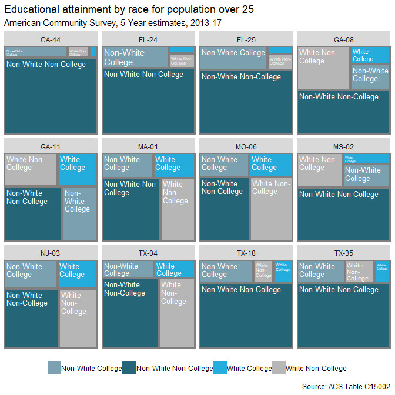

-   [Federal election data & R: some resources](#federal-election-data-r-some-resources)
    -   [Political ideologies](#political-ideologies)
    -   [2.CivilServiceUSA](#civilserviceusa)
    -   [Using `rtweets` & lists](#using-rtweets-lists)
    -   [3 Political geometries via the `tigris` package](#political-geometries-via-the-tigris-package)
    -   [Presidential elections (& others)](#presidential-elections-others)
    -   [Some census play](#some-census-play)
    -   [Some funky geographies from Daily Kos.](#some-funky-geographies-from-daily-kos.)
    -   [A work in progress.](#a-work-in-progress.)

Federal election data & R: some resources
-----------------------------------------

A collection of political data resources.

Many of the data collated here should be more easily & publicly accessible. It is not clear why they are not. In this age of alleged dat transparency, sources like 538 & CNN (especially the former) present ...

-   [Poliitcal Ideologies via `Rvoteview`](#political-ideogiees)

``` r
library(Rvoteview)#devtools::install_github("voteview/Rvoteview")
library(tidyverse)
```

Viz packages.

``` r
library(ggthemes)
library(ggrepel)#devtools::install_github("slowkow/ggrepel")
library(ggridges)
library(treemapify)
library(formattable)
```

------------------------------------------------------------------------

LAWMAKER DETAILS: IDEOLOGY & BIOGRAPHICALS

Congressional composition & voting patterns.

### Political ideologies

***So what do you want to do this weekend?*** &gt; We shall see then wont we & back up off me then.

Senate/House details by congress. Perhaps add 'divergent' visual over time.

``` r
#sen115 <- Rvoteview:: member_search(chamber= 'Senate', congress = 115)

house30 <- lapply(c(66:115), function (x)
                    Rvoteview::member_search (
                      chamber = 'House', 
                      congress = x)) %>% 
  bind_rows()
```

A bit of a viz. Note that these percentages are not erfect, as non-major political parties are not included (which comprise a very small overall peracentage).

``` r
house30 %>%
  filter(party_name %in% c('Democratic Party', 'Republican Party')) %>%
  group_by(congress, party_name) %>%
  summarize(n = n()) %>%
  mutate(n = n/sum(n)) %>%
  ggplot(aes(x=congress, y=n, fill = party_name)) +
  geom_area(alpha = 0.65, color = 'gray') +
  ggthemes::scale_fill_fivethirtyeight()+
  geom_hline(yintercept = 0.5, color = 'white', linetype = 2) +
  theme(legend.position = "bottom")+
  labs(title = "House Composition over the last 50 congresses")
```


``` r
house30 %>%
  filter(congress > 89) %>%
    ggplot(aes(x=nominate.dim1, y=as.factor(congress), fill = congress)) +
      ggridges::geom_density_ridges(rel_min_height = 0.01) +
    geom_vline(xintercept = 0, color = 'black', linetype = 2) +
      theme(legend.position = "none", 
            plot.title = element_text(size=14)) + 
      ylab("")+
      labs(title = "Political ideologies in the US Senates 90 to 115")
```


An alternative approach. --- Voteview data with NOKKEN & POOLE scores.

(that change per congress). Scores via `Rvoteview` only DW\_Nominate, which reflect an aggregate score based on lawmaker's entire voting history (eben if they switch houses, which is weird).

Perhaps add some visualizations. A la divisiveness.

``` r
sen115 <- read.csv(url("https://voteview.com/static/data/out/members/HSall_members.csv"),
  stringsAsFactors = FALSE) %>%
  mutate(bioname = gsub(',.*$', '', bioname)) %>%
  filter(chamber == 'Senate' & congress == 115)
```

------------------------------------------------------------------------

### 2.CivilServiceUSA

Mention the `bioguide` which helps cross.

``` r
library(jsonlite)
sen_url <- 'https://raw.githubusercontent.com/CivilServiceUSA/us-senate/master/us-senate/data/us-senate.json'

senate_dets <-  jsonlite::fromJSON(url(sen_url)) %>%
  mutate(twitter_handle = ifelse(twitter_handle == 'SenJeffFlake', 'JeffFlake', twitter_handle)) %>%
  mutate (twitter_handle = tolower(twitter_handle)) %>%
  rename (bioguide_id = bioguide) %>%
  left_join(sen115 %>% 
              filter(congress == 115) %>%
              select(bioguide_id, party_code, nominate_dim1)) %>%
  mutate(party = ifelse(party == 'independent', 'democrat', party))
```

``` r
#We don't run this.
house_dets <- jsonlite::fromJSON(url('https://raw.githubusercontent.com/CivilServiceUSA/us-house/master/us-house/data/us-house.json')) 
```

So, a quick demo.

``` r
library(lubridate)
house_dets %>%
  mutate (years = 
            lubridate::year(as.Date(Sys.Date())) -
            lubridate::year(as.Date(date_of_birth))) %>%
  ggplot (aes(years)) +
  geom_histogram(bins=20, fill = 'cornflowerblue') +
  labs(title = 'Age distributions in the 115th US House')
```


``` r
  #ggthemes::theme_fivethirtyeight()
```

------------------------------------------------------------------------

### Using `rtweets` & lists

------------------------------------------------------------------------

### 3 Political geometries via the `tigris` package

``` r
library(tigris); options(tigris_use_cache = TRUE, tigris_class = "sf")
```

    ## Warning: package 'tigris' was built under R version 3.4.4

    ## To enable 
    ## caching of data, set `options(tigris_use_cache = TRUE)` in your R script or .Rprofile.

    ## 
    ## Attaching package: 'tigris'

    ## The following object is masked from 'package:graphics':
    ## 
    ##     plot

``` r
us_house_districts <- tigris::congressional_districts(cb = TRUE) %>% select(GEOID,STATEFP, CD115FP) %>%
  
  left_join(tigris::states(cb = TRUE) %>% 
              data.frame() %>%
              select(STATEFP, STUSPS)) 
```

    ## Joining, by = "STATEFP"

------------------------------------------------------------------------

### Presidential elections (& others)

[Daily Kos data sets](https://www.dailykos.com/stories/2018/2/21/1742660/-The-ultimate-Daily-Kos-Elections-guide-to-all-of-our-data-sets)

As list, perhaps -- ? Using DailyKOS & `gsheets`.

Not fantastic structure-wise. Some lawmaker bio details (Name, First elected, Birth Year, Gender, RAce/ethnicity, Religion, LGBT). House sheet: 2016/2012/2008 presidential election results by congressional district; along with 2016/2014 house congressional results; No 2018 results.

Also includes some socio-dems by district, but this is likely more easily addressed using `tidycensus`.

Need to create a GEOID column to add lawmaker details + mapping.

ALSO: Add source names to table names.

``` r
library(gsheet)
url <- 'https://docs.google.com/spreadsheets/d/1oRl7vxEJUUDWJCyrjo62cELJD2ONIVl-D9TSUKiK9jk/edit#gid=1178631925'

house <- gsheet::gsheet2tbl(url) 
```

Data are super dirty. A simple cleaning procedure that will scale (for the most part) to other data sources at the Daily Kos. With a simple focus on ... :

``` r
fix <- as.data.frame(cbind(colnames(house), as.character(house[1,])), 
  string_as_factor = FALSE) %>%
  mutate(V1 = gsub('^X', NA, V1)) %>%
  fill(V1) %>%
  mutate(nw_cols = ifelse(is.na(V2), V1, paste0(V1, '_', V2)),
         nw_cols = gsub(' ', '_', nw_cols))

colnames(house) <- fix$nw_cols

house <- house %>% slice(3:nrow(.))

keeps <- house[,!grepl('Pronun|ACS|Census|Survey', colnames(house))]
```

Presidential elections (for now).

``` r
dailykos_pres_elections <- keeps [,c('District', 'Code', grep('President_[A-z]', colnames(house), value=T))] %>%
  gather (key = election, value = percent, `2016_President_Clinton`:`2008_President_McCain`) %>%
  mutate(election = gsub('President_', '', election),
         percent = as.numeric(percent)) %>%
  separate(Code, c('STUSPS', 'CD115FP')) %>%
  separate(election, c('year', 'candidate'))%>%
  mutate(CD115FP = ifelse(CD115FP == 'AL', '00', CD115FP)) %>%
  left_join(us_house_districts)
```

    ## Joining, by = c("STUSPS", "CD115FP")

``` r
dailykos_pres_elections %>% head() %>% formattable::formattable()
```

<table class="table table-condensed">
<thead>
<tr>
<th style="text-align:right;">
District
</th>
<th style="text-align:right;">
STUSPS
</th>
<th style="text-align:right;">
CD115FP
</th>
<th style="text-align:right;">
year
</th>
<th style="text-align:right;">
candidate
</th>
<th style="text-align:right;">
percent
</th>
<th style="text-align:right;">
GEOID
</th>
<th style="text-align:right;">
STATEFP
</th>
<th style="text-align:right;">
geometry
</th>
</tr>
</thead>
<tbody>
<tr>
<td style="text-align:right;">
Alabama 1st
</td>
<td style="text-align:right;">
AL
</td>
<td style="text-align:right;">
01
</td>
<td style="text-align:right;">
2016
</td>
<td style="text-align:right;">
Clinton
</td>
<td style="text-align:right;">
34.1
</td>
<td style="text-align:right;">
0101
</td>
<td style="text-align:right;">
01
</td>
<td style="text-align:right;">
MULTIPOLYGON (((-88.05338 3...
</td>
</tr>
<tr>
<td style="text-align:right;">
Alabama 2nd
</td>
<td style="text-align:right;">
AL
</td>
<td style="text-align:right;">
02
</td>
<td style="text-align:right;">
2016
</td>
<td style="text-align:right;">
Clinton
</td>
<td style="text-align:right;">
33.0
</td>
<td style="text-align:right;">
0102
</td>
<td style="text-align:right;">
01
</td>
<td style="text-align:right;">
MULTIPOLYGON (((-87.4272 31...
</td>
</tr>
<tr>
<td style="text-align:right;">
Alabama 3rd
</td>
<td style="text-align:right;">
AL
</td>
<td style="text-align:right;">
03
</td>
<td style="text-align:right;">
2016
</td>
<td style="text-align:right;">
Clinton
</td>
<td style="text-align:right;">
32.3
</td>
<td style="text-align:right;">
0103
</td>
<td style="text-align:right;">
01
</td>
<td style="text-align:right;">
MULTIPOLYGON (((-86.57753 3...
</td>
</tr>
<tr>
<td style="text-align:right;">
Alabama 4th
</td>
<td style="text-align:right;">
AL
</td>
<td style="text-align:right;">
04
</td>
<td style="text-align:right;">
2016
</td>
<td style="text-align:right;">
Clinton
</td>
<td style="text-align:right;">
17.4
</td>
<td style="text-align:right;">
0104
</td>
<td style="text-align:right;">
01
</td>
<td style="text-align:right;">
MULTIPOLYGON (((-88.27414 3...
</td>
</tr>
<tr>
<td style="text-align:right;">
Alabama 5th
</td>
<td style="text-align:right;">
AL
</td>
<td style="text-align:right;">
05
</td>
<td style="text-align:right;">
2016
</td>
<td style="text-align:right;">
Clinton
</td>
<td style="text-align:right;">
31.3
</td>
<td style="text-align:right;">
0105
</td>
<td style="text-align:right;">
01
</td>
<td style="text-align:right;">
MULTIPOLYGON (((-88.20296 3...
</td>
</tr>
<tr>
<td style="text-align:right;">
Alabama 6th
</td>
<td style="text-align:right;">
AL
</td>
<td style="text-align:right;">
06
</td>
<td style="text-align:right;">
2016
</td>
<td style="text-align:right;">
Clinton
</td>
<td style="text-align:right;">
26.1
</td>
<td style="text-align:right;">
0106
</td>
<td style="text-align:right;">
01
</td>
<td style="text-align:right;">
MULTIPOLYGON (((-87.42194 3...
</td>
</tr>
</tbody>
</table>

------------------------------------------------------------------------

### Some census play

Race, education & census data (for good measure):

Census race/ethnicity per US Census classifications.

``` r
code <- c('A', 'B', 'C', 'D', 'E',
          'F', 'G', 'H', 'I')
          
          
race <- c('WHITE ALONE', 'BLACK OR AFRICAN AMERICAN ALONE',
          'AMERICAN INDIAN OR ALASKAN NATIVE ALONE',
          'ASIAN ALONE', 
          'NATIVE HAWAIIAN AND OTHER PACIFIC ISLANDER ALONE', 
          'SOME OTHER RACE ALONE', 'TWO OR MORE RACES',
          'WHITE ALONE, NOT HISPANIC OR LATINO',
          'HISPANC OR LATINO')

race_table <- as.data.frame(cbind(code,race),
                            stringsAsFactors=FALSE)
```

C15002: SEX BY EDUCATIONAL ATTAINMENT FOR THE POPULATION 25 YEARS AND OVER

``` r
#Educational attainment by gender
search_vars <- var_list[grepl('C1500', var_list$name),]

#ID Table name. For good measure.

data <- tidycensus::get_acs(geography = 'congressional district',
                            variables = search_vars$name,
                            summary_var = 'B15002_001') %>%
  left_join(search_vars %>% rename(variable = name)) %>%
  filter(!grepl('Total$|Female$|Male$', label)) %>%
  
  mutate(gender = ifelse(grepl('Male', label), 'Male', 'Female'),
         label = gsub('^Estimate.*!!', '', label),
         code = gsub('(C[0-9]+)([A-Z])(_[0-9]+.$)', 
                     '\\2', 
                     variable)) %>%
  left_join (race_table) %>%
  select(GEOID, label, gender, race, estimate:summary_moe)
```

White men without college degree. As percentage of total population over 25. ie, as a percentage of the electorate. Also -- map zoomed into some interesting sub0location.

``` r
#Non-continental US
nonx <- c('78', '69', '66', '72', '60', '15', '02')
  
us_house_districts %>% 
  left_join(data %>% 
              filter(label != 'Bachelor\'s degree or higher' &
                       gender == 'Male' & 
                       race == 'WHITE ALONE, NOT HISPANIC OR LATINO')) %>%
  mutate(per = estimate / summary_est) %>%
  filter(!gsub('..$' ,'', GEOID) %in% nonx) %>%
  ggplot() + 
  geom_sf(aes(fill = per)) + #, color = 'darkgray'
  
  scale_fill_distiller(palette='PRGn')+
  
  theme(axis.title.x=element_blank(),
        axis.text.x=element_blank(),
        axis.title.y=element_blank(),
        axis.text.y=element_blank(),
        legend.position = 'bottom') +
  labs(title = "% no degree White males by congressional district")
```


Create plots of some cherry-picked district cross-sections (per Daily Kos).

Definitions: WHITE ALONE means/equals all the whites, hispanic or otherwise. OR, WHITE ALONE, HISPANIC + WHITE ALONE, NOT HISPANIC.

``` r
tree <- data %>%
  mutate (race = gsub(', | ', '_', race)) %>%
  select(-moe:-summary_moe) %>%
  spread(race, estimate) %>%
  mutate(WHITE_ALONE_HISPANIC = WHITE_ALONE - WHITE_ALONE_NOT_HISPANIC_OR_LATINO) %>%
  gather(key = race, value = estimate, AMERICAN_INDIAN_OR_ALASKAN_NATIVE_ALONE:WHITE_ALONE_HISPANIC) %>%
  filter(race != 'HISPANIC OR LATINO') %>%
  mutate(race_cat = ifelse(race == 'WHITE_ALONE_NOT_HISPANIC_OR_LATINO', 'White', 'Non-White'),
    ed_cat = ifelse(label == 'Bachelor\'s degree or higher', 'College', 'Non-College'))%>%
  group_by(GEOID, race_cat, ed_cat) %>%
  summarize(estimate = sum(estimate)) %>%
  group_by(GEOID) %>%
  mutate(per = estimate/sum(estimate)) %>%
  ungroup()
```

Non-College White share. WE should check how this is calculated. Or at least define how we define it.

Also: WE need to cross GEOID to actual state/congressional districts for some reference.

``` r
samp_n <- sample(unique(tree$GEOID), 12)

tree %>%
  filter(GEOID %in% samp_n) %>%
    ggplot(aes(area = per,
               fill = paste0(race_cat, ' ', ed_cat),
               label = paste0(race_cat, ' ', ed_cat),
               subgroup = paste0(race_cat, ' ', ed_cat)))+
      geom_treemap(alpha=.85)+
      geom_treemap_subgroup_border() +

      geom_treemap_text(colour = "white", 
                        place = "topleft", 
                        reflow = T,
                        size = 9.5)+
      scale_fill_economist()+ 
  theme_fivethirtyeight()+
  facet_wrap(~GEOID) +
      theme(legend.position = "bottom",
            plot.title = element_text(size=12),
            legend.title=element_blank()) + 
      labs(title = "Educational attainment by race for population over 25")
```


``` r
#Add Year + Source.  
```

Trump ed/race dems by binned degrees of support.

``` r
dailykos_pres_elections %>%
  filter(candidate == 'Trump') %>%
  mutate(cut = cut_number(percent, n =10),
         rank_cut = dense_rank(cut)) %>%

  left_join(tree) %>%
  mutate(type = paste0(race_cat, ' ', ed_cat))%>%
  select(type, rank_cut, estimate) %>%
  group_by(type, rank_cut) %>%
  
  summarize(estimate = sum(estimate)) %>%
  
  group_by(rank_cut)%>%
  mutate(new_per = estimate/sum(estimate)) %>%
  
  ggplot(aes(x=(rank_cut), y=new_per, fill = type)) +
  geom_area(alpha = 0.75, color = 'gray') +
  ggthemes::scale_fill_economist()+
  theme(legend.position = "bottom")+
  labs(title = "Composition of corpus (in tokens) over time")
```

    ## Joining, by = "GEOID"



------------------------------------------------------------------------

### Some funky geographies from Daily Kos.

------------------------------------------------------------------------

### A work in progress.
