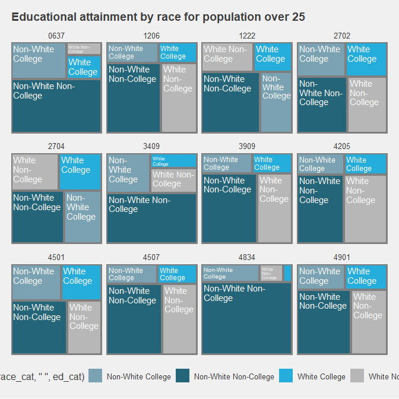

A collection of political data resources. Or something like this.

And perhaps formally aggregate/collate some of these resources.

PERHAPS: Focus on House of Representatives. We have to finish some of these thoughts before new congress.

``` r
library(Rvoteview)#devtools::install_github("voteview/Rvoteview")
library(tidyverse)
```

Viz packages.

``` r
library(ggthemes)
library(ggrepel)#devtools::install_github("slowkow/ggrepel")
library(ggridges)
library(treemapify)
library(formattable)
```

VoteView & things
-----------------

Senate/House details by congress. Perhaps add 'divergent' visual over time.

``` r
#sen115 <- Rvoteview:: member_search(chamber= 'Senate', congress = 115)

house30 <- lapply(c(66:115), function (x)
                    Rvoteview::member_search (
                      chamber = 'House', 
                      congress = x)) %>% 
  bind_rows()
```

A bit of a viz. Note that these percentages are not erfect, as non-major political parties are not included (which comprise a very small overall peracentage).

``` r
house30 %>%
  filter(party_name %in% c('Democratic Party', 'Republican Party')) %>%
  group_by(congress, party_name) %>%
  summarize(n = n()) %>%
  mutate(n = n/sum(n)) %>%
  ggplot(aes(x=congress, y=n, fill = party_name)) +
  geom_area(alpha = 0.65, color = 'gray') +
  ggthemes::scale_fill_fivethirtyeight()+
  geom_hline(yintercept = 0.5, color = 'white', linetype = 2) +
  theme(legend.position = "bottom")+
  labs(title = "House Composition over the last 50 congresses")
```


Voteview data with Poole & xyz scores (that change per congress). Scores via `Rvoteview` only DW\_Nominate, which reflect an aggregate score based on lawmaker's entire voting history (eben if they switch houses, which is weird).

Perhaps add some visualizations. A la divisiveness.

CivilServiceUSA
---------------

``` r
library(jsonlite)
sen_url <- 'https://raw.githubusercontent.com/CivilServiceUSA/us-senate/master/us-senate/data/us-senate.json'

senate_dets <-  jsonlite::fromJSON(url(sen_url)) %>%
  mutate(twitter_handle = ifelse(twitter_handle == 'SenJeffFlake', 'JeffFlake', twitter_handle)) %>%
  mutate (twitter_handle = tolower(twitter_handle)) %>%
  rename (bioguide_id = bioguide) %>%
  left_join(sen115 %>% 
              filter(congress == 115) %>%
              select(bioguide_id, party_code, nominate_dim1)) %>%
  mutate(party = ifelse(party == 'independent', 'democrat', party))
```

Using `rtweets` & lists
-----------------------

Presidential elections (& others)
---------------------------------

[Daily KOS data sets](https://www.dailykos.com/stories/2018/2/21/1742660/-The-ultimate-Daily-Kos-Elections-guide-to-all-of-our-data-sets)

As list, perhaps -- ? Using DailyKOS & `gsheets`.

Not fantastic structure-wise. Some lawmaker bio details (Name, First elected, Birth Year, Gender, RAce/ethnicity, Religion, LGBT). House sheet: 2016/2012/2008 presidential election results by congressional district; along with 2016/2014 house congressional results; No 2018 results.

Also includes some socio-dems by district, but this is likely more easily addressed using `tidycensus`.

Need to create a GEOID column to add lawmaker details + mapping.

ALSO: Add source names to table names.

``` r
library(gsheet)
```

    ## Warning: package 'gsheet' was built under R version 3.4.4

``` r
url <- 'https://docs.google.com/spreadsheets/d/1oRl7vxEJUUDWJCyrjo62cELJD2ONIVl-D9TSUKiK9jk/edit#gid=1178631925'

house <- gsheet::gsheet2tbl(url) 
```

    ## Warning: Missing column names filled in: 'X5' [5], 'X7' [7], 'X16' [16],
    ## 'X18' [18], 'X20' [20], 'X22' [22], 'X24' [24], 'X26' [26], 'X28' [28],
    ## 'X29' [29], 'X30' [30], 'X31' [31], 'X32' [32], 'X34' [34], 'X35' [35],
    ## 'X36' [36], 'X37' [37], 'X38' [38], 'X40' [40], 'X41' [41], 'X42' [42],
    ## 'X43' [43], 'X44' [44], 'X47' [47], 'X48' [48], 'X49' [49], 'X51' [51],
    ## 'X52' [52], 'X54' [54], 'X55' [55], 'X57' [57], 'X58' [58], 'X60' [60],
    ## 'X61' [61], 'X62' [62], 'X64' [64], 'X65' [65], 'X66' [66], 'X68' [68],
    ## 'X70' [70], 'X71' [71], 'X72' [72], 'X74' [74], 'X75' [75], 'X76' [76],
    ## 'X77' [77], 'X78' [78], 'X79' [79], 'X81' [81], 'X82' [82], 'X83' [83],
    ## 'X84' [84], 'X85' [85], 'X86' [86], 'X88' [88], 'X89' [89], 'X90' [90],
    ## 'X91' [91], 'X92' [92], 'X93' [93], 'X95' [95], 'X96' [96], 'X97' [97],
    ## 'X98' [98], 'X99' [99], 'X100' [100]

    ## Warning: Duplicated column names deduplicated: '2016 President' => '2016
    ## President_1' [50], '2012 President' => '2012 President_1' [53], '2008
    ## President' => '2008 President_1' [56]

``` r
fix <- as.data.frame(cbind(colnames(house), as.character(house[1,])), 
  string_as_factor = FALSE) %>%
  mutate(V1 = gsub('^X', NA, V1)) %>%
  fill(V1) %>%
  mutate(nw_cols = ifelse(is.na(V2), V1, paste0(V1, '_', V2)))

colnames(house) <- fix$nw_cols

house <- house %>% slice(3:nrow(.))

keeps <- house[,!grepl('Pronun|ACS|Census|Survey', colnames(house))]
```

Some census play
----------------

Race, education & census data (for good measure):

Census race/ethnicity per US Census classifications.

``` r
code <- c('A', 'B', 'C', 'D', 'E',
          'F', 'G', 'H', 'I')
          
          
race <- c('WHITE ALONE', 'BLACK OR AFRICAN AMERICAN ALONE',
          'AMERICAN INDIAN OR ALASKAN NATIVE ALONE',
          'ASIAN ALONE', 
          'NATIVE HAWAIIAN AND OTHER PACIFIC ISLANDER ALONE', 
          'SOME OTHER RACE ALONE', 'TWO OR MORE RACES',
          'WHITE ALONE, NOT HISPANIC OR LATINO',
          'HISPANC OR LATINO')

race_table <- as.data.frame(cbind(code,race),
                            stringsAsFactors=FALSE)
```

``` r
library(tigris); options(tigris_use_cache = TRUE, tigris_class = "sf")
us_house_districts <- tigris::congressional_districts(cb = TRUE)
```

C15002: SEX BY EDUCATIONAL ATTAINMENT FOR THE POPULATION 25 YEARS AND OVER

``` r
#Educational attainment by gender
search_vars <- var_list[grepl('C1500', var_list$name),]

#ID Table name. For good measure.

data <- tidycensus::get_acs(geography = 'congressional district',
                            variables = search_vars$name,
                            summary_var = 'B15002_001') %>%
  left_join(search_vars %>% rename(variable = name)) %>%
  filter(!grepl('Total$|Female$|Male$', label)) %>%
  
  mutate(gender = ifelse(grepl('Male', label), 'Male', 'Female'),
         label = gsub('^Estimate.*!!', '', label),
         code = gsub('(C[0-9]+)([A-Z])(_[0-9]+.$)', 
                     '\\2', 
                     variable)) %>%
  left_join (race_table) %>%
  select(GEOID, label, gender, race, estimate:summary_moe)
```

    ## Getting data from the 2012-2016 5-year ACS

    ## Joining, by = "variable"

    ## Joining, by = "code"

Create plots of some cherry-picked district cross-sections (per Daily Kos).

``` r
types <- c('College White', 'Non-College White',
           'College Non-White', 'Non-College Non-White')
```

``` r
#Create a WHITE ALONE, NOT HISPANIC category here.  As mutually exculsive.  
#HOW?? --> WHITE ALONE means/equals all the whites, hispanic or otherwise.  OR, WHITE ALONE, HISPANIC + WHITE ALONE, NOT HISPANIC.   

#Importantly, all other non-White/Hispanics are already POCs.

tree <- data %>%
  mutate (race = gsub(', | ', '_', race)) %>%
  select(-moe:-summary_moe) %>%
  spread(race, estimate) %>%
  mutate(WHITE_ALONE_HISPANIC = WHITE_ALONE - WHITE_ALONE_NOT_HISPANIC_OR_LATINO) %>%
  gather(key = race, value = estimate, AMERICAN_INDIAN_OR_ALASKAN_NATIVE_ALONE:WHITE_ALONE_HISPANIC) %>%
  filter(race != 'HISPANIC OR LATINO') %>%
  mutate(race_cat = ifelse(race == 'WHITE_ALONE_NOT_HISPANIC_OR_LATINO', 'White', 'Non-White'),
    ed_cat = ifelse(label == 'Bachelor\'s degree or higher', 'College', 'Non-College'))%>%
  group_by(GEOID, race_cat, ed_cat) %>%
  summarize(estimate = sum(estimate)) %>%
  group_by(GEOID) %>%
  mutate(per = estimate/sum(estimate)) %>%
  ungroup()
```

Non-College White share. WE should check how this is calculated. Or at least define how we define it.

Also: WE need to cross GEOID to actual state/congressional districts for some reference.

``` r
samp_n <- sample(unique(tree$GEOID), 12)

tree %>%
  filter(GEOID %in% samp_n) %>%
    ggplot(aes(area = per,
               fill = paste0(race_cat, ' ', ed_cat),
               label = paste0(race_cat, ' ', ed_cat),
               subgroup = paste0(race_cat, ' ', ed_cat)))+
      geom_treemap(alpha=.85)+
      geom_treemap_subgroup_border() +

      geom_treemap_text(colour = "white", 
                        place = "topleft", 
                        reflow = T,
                        size = 11)+
      scale_fill_economist()+ 
  theme_fivethirtyeight()+
  facet_wrap(~GEOID) +
      theme(legend.position = "bottom",
            plot.title = element_text(size=14)) + 
      labs(title = "Educational attainment by race for population over 25")
```



``` r
#Add Year + Source.  
```

White men without college degree. As percentage of total population over 25. ie, as a percentage of the electorate.

``` r
#Non-continental US
nonx <- c('78', '69', '66', '72', '60', '15', '02')
  
us_house_districts %>% 
  left_join(data %>% 
              filter(label != 'Bachelor\'s degree or higher' &
                       gender == 'Male' & 
                       race == 'WHITE ALONE, NOT HISPANIC OR LATINO')) %>%
  mutate(per = estimate / summary_est) %>%
  filter(!gsub('..$' ,'', GEOID) %in% nonx) %>%
  ggplot() + 
  geom_sf(aes(fill = per)) + #, color = 'darkgray'
  
  scale_fill_distiller(palette='PRGn')+
  
  theme(axis.title.x=element_blank(),
        axis.text.x=element_blank(),
        axis.title.y=element_blank(),
        axis.text.y=element_blank(),
        legend.position = 'bottom') +
  labs(title = "% no degree White males by congressional district")
```


Some funky geographies from Daily Kos.
--------------------------------------

A work in progress.
-------------------
