Federal election data & R: some resources & methods
---------------------------------------------------

A collection of political data resources. Many of the data collated here should be more easily & publicly accessible. It is not clear why they are not.

Lots of help from the folks at ....

-   [1 Political Ideologies](#1-political-ideologies-and-congressional-composition)
-   [2 Lawmaker biographies](#2-Lawmaker-biographies)
-   [3 Political geometries](#4-political-geometries)
-   [4 Federal election results](#5-Federal-election-results)
-   [5 Census data and congressional districts](#6-Census-data-and-congressional-districts)
-   [6 Funky geometries](#7-Funky-geometries)
-   [7 Twitter](#3-Twitter)
-   [8 A work in progress](#8-A-work-in-progress)

Some additional text.

``` r
library(tidyverse)
```

------------------------------------------------------------------------

### 1 Political ideologies and congressional composition

***So what do you want to do this weekend?***

> We shall see then wont we & back up off me then.

Senate/House details by congress. Perhaps add 'divergent' visual over time.

``` r
#sen115 <- Rvoteview:: member_search(chamber= 'Senate', congress = 115)

rvoteview_house_50 <- lapply(c(66:115), function (x)
                    Rvoteview::member_search (
                      chamber = 'House', 
                      congress = x)) %>% 
  bind_rows()
```

A bit of a viz. Note that these percentages are not erfect, as non-major political parties are not included (which comprise a very small overall peracentage).

``` r
rvoteview_house_50 %>%
  filter(party_name %in% c('Democratic Party', 'Republican Party')) %>%
  group_by(congress, party_name) %>%
  summarize(n = n()) %>%
  mutate(n = n/sum(n)) %>%
  ggplot(aes(x=congress, y=n, fill = party_name)) +
  geom_area(alpha = 0.65, color = 'gray') +
  ggthemes::scale_fill_fivethirtyeight()+
  geom_hline(yintercept = 0.5, color = 'white', linetype = 2) +
  theme(legend.position = "bottom")+
  labs(title = "House Composition over the last 50 congresses")
```

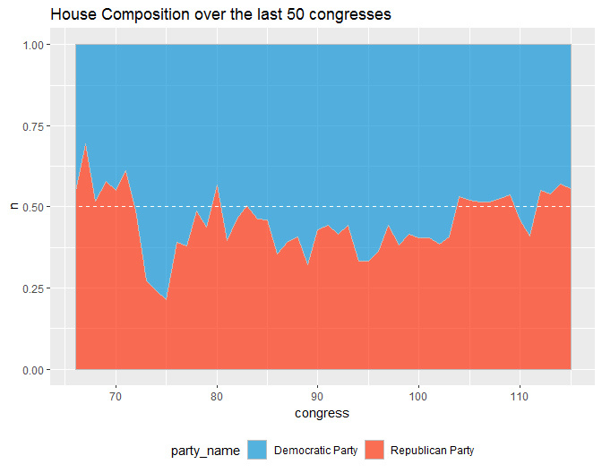

``` r
rvoteview_house_50 %>%
  filter(congress > 89) %>%
    ggplot(aes(x=nominate.dim1, y=as.factor(congress), fill = congress)) +
      ggridges::geom_density_ridges(rel_min_height = 0.01) +
    geom_vline(xintercept = 0, color = 'black', linetype = 2) +
      theme(legend.position = "none", 
            plot.title = element_text(size=14)) + 
      ylab("")+
      labs(title = "Political ideologies in US Houses 90 to 115")
```

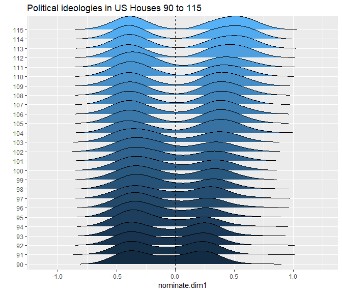

An alternative approach. --- Voteview data with NOKKEN & POOLE scores.

(that change per congress). Scores via `Rvoteview` only DW\_Nominate, which reflect an aggregate score based on lawmaker's entire voting history (eben if they switch houses, which is weird).

Perhaps add some visualizations. A la divisiveness.

``` r
sen115 <- read.csv(url("https://voteview.com/static/data/out/members/HSall_members.csv"),
  stringsAsFactors = FALSE) %>%
  mutate(bioname = gsub(',.*$', '', bioname)) %>%
  filter(chamber == 'Senate' & congress == 115)
```

------------------------------------------------------------------------

### 2 Lawmaker biographies

Mention the `bioguide` which helps cross.

CivilServiceUSA

``` r
library(jsonlite)
sen_url <- 'https://raw.githubusercontent.com/CivilServiceUSA/us-senate/master/us-senate/data/us-senate.json'

senate_dets <-  jsonlite::fromJSON(url(sen_url)) %>%
  mutate(twitter_handle = ifelse(twitter_handle == 'SenJeffFlake', 'JeffFlake', twitter_handle)) %>%
  mutate (twitter_handle = tolower(twitter_handle)) %>%
  rename (bioguide_id = bioguide) %>%
  left_join(sen115 %>% 
              filter(congress == 115) %>%
              select(bioguide_id, party_code, nominate_dim1)) %>%
  mutate(party = ifelse(party == 'independent', 'democrat', party))
```

``` r
#We don't run this.
house_dets <- jsonlite::fromJSON(url('https://raw.githubusercontent.com/CivilServiceUSA/us-house/master/us-house/data/us-house.json')) 
```

So, a quick demo.

``` r
house_dets %>%
  mutate (years = 
            lubridate::year(as.Date(Sys.Date())) -
            lubridate::year(as.Date(date_of_birth))) %>%
  ggplot (aes(years)) +
  geom_histogram(bins=20, fill = 'steelblue') +
  labs(title = 'Age distributions in the 115th US House')
```

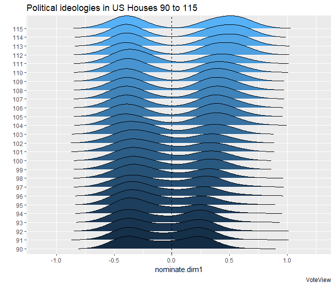

``` r
  #ggthemes::theme_fivethirtyeight()
```

And perhaps a look at religion for good measure.

``` r
cols <- RColorBrewer::brewer.pal(4, 'Set1')
cols = colorRampPalette(cols)(31)

house_dets %>%
  group_by(religion) %>%
  summarize(n = n()) %>%
  na.omit() %>%
    ggplot(aes(area = n,
               fill = religion,
               label = religion,
               subgroup = religion)) +
      treemapify::geom_treemap(alpha=.85) +
      treemapify::geom_treemap_subgroup_border() +
      treemapify::geom_treemap_text(colour = "white", 
                        place = "topleft", 
                        reflow = T,
                        size = 11)+
      scale_fill_manual(values = cols) +
      theme(legend.position = "none",
            #plot.title = element_text(size=12),
            legend.title=element_blank()) +
      labs(title = 'Religions in the 115th US House')
```

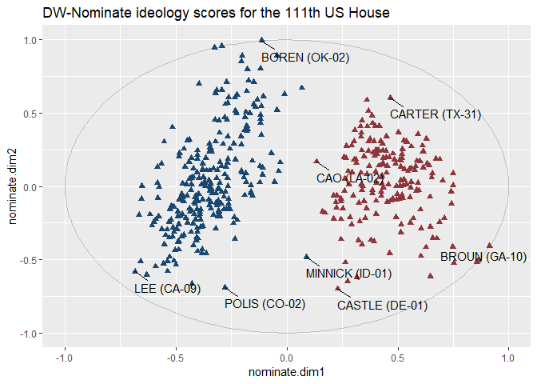

------------------------------------------------------------------------

### 3 Political geometries

``` r
nonx <- c('78', '69', '66', '72', '60', '15', '02')

library(tigris); options(tigris_use_cache = TRUE, tigris_class = "sf")
us_house_districts <- tigris::congressional_districts(cb = TRUE) %>%
  select(GEOID,STATEFP, CD115FP) %>%
  
  left_join(tigris::states(cb = TRUE) %>% 
              data.frame() %>%
              select(STATEFP, STUSPS)) 

laea <- sf::st_crs("+proj=laea +lat_0=30 +lon_0=-95") # Lambert equal area
us_house_districts <- sf::st_transform(us_house_districts, laea)
```

------------------------------------------------------------------------

### 4 Federal election results

[Daily Kos data sets](https://www.dailykos.com/stories/2018/2/21/1742660/-The-ultimate-Daily-Kos-Elections-guide-to-all-of-our-data-sets)

Not fantastic structure-wise. Some lawmaker bio details (Name, First elected, Birth Year, Gender, RAce/ethnicity, Religion, LGBT). House sheet: 2016/2012/2008 presidential election results by congressional district; along with 2016/2014 house congressional results; No 2018 results.

Also includes some socio-dems by district, but this is likely more easily addressed using `tidycensus`.

``` r
url <- 'https://docs.google.com/spreadsheets/d/1oRl7vxEJUUDWJCyrjo62cELJD2ONIVl-D9TSUKiK9jk/edit#gid=1178631925'

house <- gsheet::gsheet2tbl(url) 
```

Data are super dirty. A simple cleaning procedure that will scale (for the most part) to other data sources at the Daily Kos. With a simple focus on ... :

``` r
fix <- as.data.frame(cbind(colnames(house), as.character(house[1,])), 
  string_as_factor = FALSE) %>%
  mutate(V1 = gsub('^X', NA, V1)) %>%
  fill(V1) %>%
  mutate(nw_cols = ifelse(is.na(V2), V1, paste0(V1, '_', V2)),
         nw_cols = gsub(' ', '_', nw_cols))

colnames(house) <- fix$nw_cols
house <- house %>% slice(3:nrow(.))
keeps <- house[,!grepl('Pronun|ACS|Census|Survey', colnames(house))]
```

Here we filter to data to the last three Presidential elections.

``` r
dailykos_pres_elections <- keeps [,c('District', 'Code', grep('President_[A-z]', colnames(house), value=T))] %>%
  gather (key = election, value = percent, `2016_President_Clinton`:`2008_President_McCain`) %>%
  mutate(election = gsub('President_', '', election),
         percent = as.numeric(percent)) %>%
  separate(Code, c('STUSPS', 'CD115FP')) %>%
  separate(election, c('year', 'candidate'))%>%
  mutate(CD115FP = ifelse(CD115FP == 'AL', '00', CD115FP)) %>%
  left_join(data.frame(us_house_districts) %>% select (-geometry))
```

Need to do something here. Perhaps a bit of a map.

``` r
us_house_districts %>%
  filter(!gsub('..$' ,'', GEOID) %in% nonx) %>%
  left_join(dailykos_pres_elections %>% 
              filter(year == '2016') %>%
              spread(candidate, percent) %>%
              mutate(dif = Trump-Clinton)) %>%
  ggplot() + 
  geom_sf(aes(fill = dif)) + #, color = 'darkgray'
  
  scale_fill_distiller(palette='RdBu')+
  theme(axis.title.x=element_blank(),
        axis.text.x=element_blank(),
        axis.title.y=element_blank(),
        axis.text.y=element_blank(),
        legend.position = 'bottom') +
  labs(title = "Trump support - Clinton support",
       subtitle = '2016 Presidential Elections',
       caption = 'Source: Daily Kos')
```

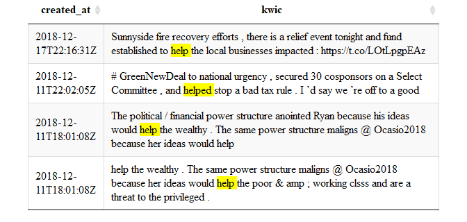

Using the area of congressional districts (in log square meters) as a proxy for degree of urbanity. ... Plot Trump support as function of CD area.

``` r
us_house_districts %>%
  left_join(dailykos_pres_elections %>%
              filter(year == '2016' & candidate == 'Trump')) %>%
  mutate(area = as.numeric(gsub(' m^2]', '', sf::st_area(.)))) %>%
  ggplot(aes(percent, log(area))) +
  geom_point(color = 'steelblue') +
  geom_smooth(method="loess", se=T, color = 'darkgrey')+
  labs(title = "2016 Trump support vs. log(area) of congressional district")
```

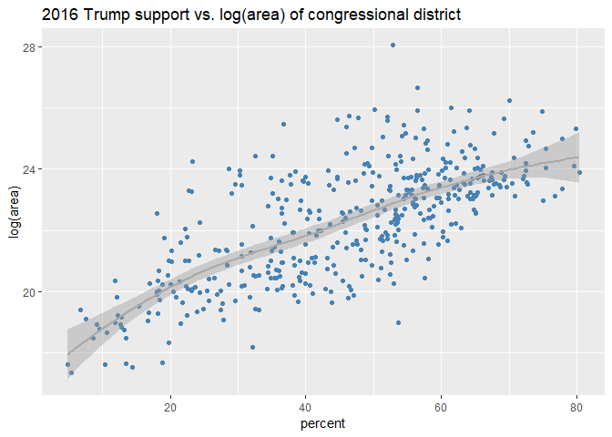

------------------------------------------------------------------------

### 5 Census data and congressional districts

Race, education & census data (for good measure):

    ## To install your API key for use in future sessions, run this function with `install = TRUE`.

Census race/ethnicity per US Census classifications.

``` r
code <- c('A', 'B', 'C', 'D', 'E',
          'F', 'G', 'H', 'I')
          
          
race <- c('WHITE ALONE', 'BLACK OR AFRICAN AMERICAN ALONE',
          'AMERICAN INDIAN OR ALASKAN NATIVE ALONE',
          'ASIAN ALONE', 
          'NATIVE HAWAIIAN AND OTHER PACIFIC ISLANDER ALONE', 
          'SOME OTHER RACE ALONE', 'TWO OR MORE RACES',
          'WHITE ALONE, NOT HISPANIC OR LATINO',
          'HISPANC OR LATINO')

race_table <- as.data.frame(cbind(code,race),
                            stringsAsFactors=FALSE)
```

C15002: SEX BY EDUCATIONAL ATTAINMENT FOR THE POPULATION 25 YEARS AND OVER

``` r
#Educational attainment by gender
search_vars <- var_list[grepl('C1500', var_list$name),]

#ID Table name. For good measure.

data <- tidycensus::get_acs(geography = 'congressional district',
                            variables = search_vars$name,
                            summary_var = 'B15002_001',
                            year = 2017,
                            survey = 'acs5') %>%
  left_join(search_vars %>% rename(variable = name)) %>%
  filter(!grepl('Total$|Female$|Male$', label)) %>%
  
  mutate(gender = ifelse(grepl('Male', label), 'Male', 'Female'),
         label = gsub('^Estimate.*!!', '', label),
         code = gsub('(C[0-9]+)([A-Z])(_[0-9]+.$)', 
                     '\\2', 
                     variable)) %>%
  left_join (race_table) %>%
  select(GEOID, label, gender, race, estimate:summary_moe)
```

White men without college degree. As percentage of total population over 25. ie, as a percentage of the electorate. Also -- map zoomed into some interesting sub0location. NEED to re-project.

``` r
#Non-continental US
us_house_districts %>% 
  filter(!gsub('..$' ,'', GEOID) %in% nonx) %>%
  left_join(data %>% 
              filter(label != 'Bachelor\'s degree or higher' &
                     gender == 'Male' & 
                     race == 'WHITE ALONE, NOT HISPANIC OR LATINO')) %>%
  mutate(per = estimate / summary_est) %>%
  ggplot() + 
  geom_sf(aes(fill = per)) + #, color = 'darkgray'
  
  scale_fill_distiller(palette='PRGn')+
  
  theme(axis.title.x=element_blank(),
        axis.text.x=element_blank(),
        axis.title.y=element_blank(),
        axis.text.y=element_blank(),
        legend.position = 'bottom') +
  labs(title = "% no degree White males by congressional district",
       caption = 'Source: ACS Table C15002')
```

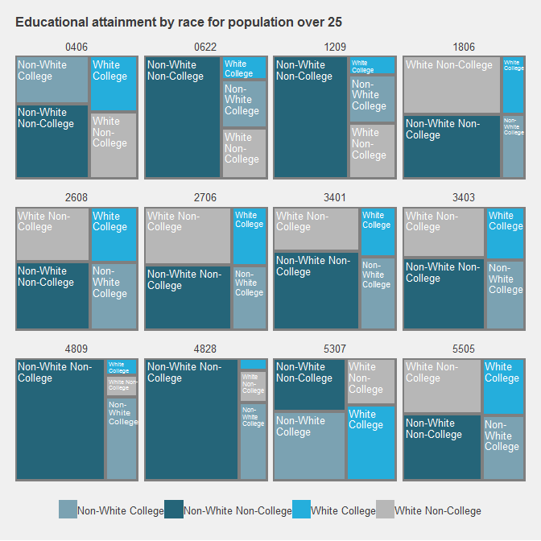

Create plots of some cherry-picked district cross-sections (per Daily Kos).

Definitions: WHITE ALONE means/equals all the whites, hispanic or otherwise. OR, WHITE ALONE, HISPANIC + WHITE ALONE, NOT HISPANIC.

``` r
tree <- data %>%
  left_join(data.frame(us_house_districts) %>% select(GEOID, STUSPS, CD115FP)) %>%
  mutate (race = gsub(', | ', '_', race)) %>%
  select(-moe:-summary_moe) %>%
  spread(race, estimate) %>%
  mutate(WHITE_ALONE_HISPANIC = WHITE_ALONE - WHITE_ALONE_NOT_HISPANIC_OR_LATINO) %>%
  gather(key =race, value = estimate, AMERICAN_INDIAN_OR_ALASKAN_NATIVE_ALONE:WHITE_ALONE_HISPANIC) %>%
  filter(race != 'HISPANIC OR LATINO') %>%
  mutate(race_cat = ifelse(race == 'WHITE_ALONE_NOT_HISPANIC_OR_LATINO', 'White', 'Non-White'),
    ed_cat = ifelse(label == 'Bachelor\'s degree or higher', 'College', 'Non-College'))%>%
  group_by(GEOID, STUSPS, CD115FP, race_cat, ed_cat) %>%
  summarize(estimate = sum(estimate)) %>%
  group_by(GEOID) %>%
  mutate(per = estimate/sum(estimate)) %>%
  ungroup()
```

Non-College White share. WE should check how this is calculated. Or at least define how we define it.

Also: WE need to cross GEOID to actual state/congressional districts for some reference.

``` r
samp_n <- sample(unique(tree$GEOID), 12)

tree %>%
  filter(GEOID %in% samp_n) %>%
    ggplot(aes(area = per,
               fill = paste0(race_cat, ' ', ed_cat),
               label = paste0(race_cat, ' ', ed_cat),
               subgroup = paste0(race_cat, ' ', ed_cat)))+
      treemapify::geom_treemap(alpha=.85)+
      treemapify::geom_treemap_subgroup_border() +

      treemapify::geom_treemap_text(colour = "white", 
                        place = "topleft", 
                        reflow = T,
                        size = 9.5)+
      ggthemes::scale_fill_economist()+ 
      #ggthemes::theme_fivethirtyeight()+
      facet_wrap(~paste0(STUSPS, '-', CD115FP)) +
      theme(legend.position = "bottom",
            #plot.title = element_text(size=12),
            legend.title=element_blank()) + 
      labs(title = "Educational attainment by race for population over 25",
           subtitle = 'American Community Survey, 5-Year estimates, 2013-17',
           caption = 'Source: ACS Table C15002')
```

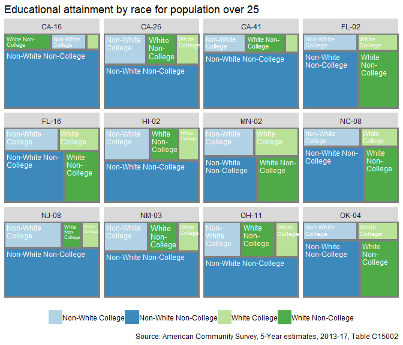

Trump ed/race dems by binned degrees of support.

``` r
ed_45 <- dailykos_pres_elections %>%
  filter(candidate == 'Trump') %>%
  group_by(candidate) %>%
  mutate(cut = cut_number(percent, n =10),
         rank_cut = dense_rank(cut)) 
```

A summary of congressional districts:

``` r
table(ed_45$cut)
```

    ## 
    ##  [4.9,21.4] (21.4,30.5] (30.5,36.6] (36.6,43.1] (43.1,48.7] (48.7,53.1] 
    ##          44          46          42          42          45          42 
    ## (53.1,56.2] (56.2,60.9] (60.9,65.6] (65.6,80.4] 
    ##          44          44          42          44

Describe plot. The average educational attainment profile for each level (ie, bin) of support for 45.

``` r
ed_45 %>%
  left_join(tree) %>%
  mutate(type = paste0(race_cat, ' ', ed_cat)) %>%
  select(type, rank_cut, cut, estimate) %>%
  group_by(type, cut, rank_cut) %>%
  summarize(estimate = sum(estimate)) %>%
  group_by(cut)%>%
  mutate(new_per = estimate/sum(estimate)) %>%
  
ggplot(aes(x=(rank_cut), y=new_per, fill = type)) +
  geom_area(alpha = 0.75, color = 'gray') +
  ggthemes::scale_fill_economist()+
  scale_x_continuous(breaks = 1:10, labels = 1:10) + 
  theme(legend.position = "bottom")+
  labs(title = "Educational attainment profiles by level of support for 45",
       subtitle = '2016 Presidential Election')+
  xlab('Level of support for 45')+ylab(NULL)
```

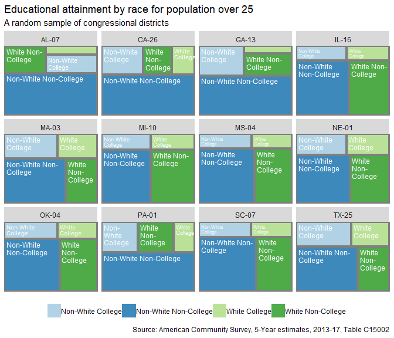

Compare to Hilary.

------------------------------------------------------------------------

### 6 Funky geometries

The Daily Kos has a cache of fun shapefiles.

#### Hexmap of Congressional districs

``` r
url <- 'https://drive.google.com/uc?authuser=0&id=1E_P0r1Uv438fZsvKsvidIR02Nb5Ju9zf&export=download/HexCDv12.zip'

url2 <- 'https://drive.google.com/uc?authuser=0&id=0B2X3Bx1aCHsJVWxYZGtxMGhrMEE&export=download/HexSTv11.zip'
```

Download & load shapefile as an `sf` object -- as process.

``` r
get_url_shape <- function (url) {
  temp <- tempdir()
  zip_name <- paste0(temp, '\\', basename(url))
  download.file(url, zip_name, 
                quiet = TRUE)
  unzip(zip_name, exdir = temp)
  x <- sf::st_read(dsn = gsub('\\.zip', '', zip_name), 
                   layer = gsub('\\.zip','', basename(url)),
                   quiet = TRUE) 
  unlink(temp) 
  x}
```

Apply function.

``` r
dailykos_shapes <- lapply (c(url, url2), get_url_shape)
names(dailykos_shapes) <- c('cds', 'states')
#State hex shapefile is slightly broken.
dailykos_shapes$states <- lwgeom::st_make_valid(dailykos_shapes$states)
```

``` r
dailykos_pres_flips <- dailykos_pres_elections %>%
  group_by(District, year) %>%
  filter(percent == max(percent))%>%
  mutate(dups = n()) %>%
  filter(dups != 2) %>% #Kill ties --> n = 3
  select(-percent, -dups) %>%
  spread(year, candidate) %>%
  na.omit()%>%
  mutate(flips = paste0(`2008`, '~',`2012`, '~', `2016`))
```

Need to add state hex shape. Note that this has been reproduced.

``` r
dailykos_shapes$cds %>%
  inner_join(dailykos_pres_flips)%>%
  ggplot() + 
  geom_sf(aes(fill = flips),
           color = 'white', alpha = .85) + 
    geom_sf(data=dailykos_shapes$states, 
          fill = NA, 
          show.legend = F, 
          color="darkgray", 
          lwd=.75) +
    ggsflabel::geom_sf_text(data = dailykos_shapes$states,
                                aes(label = STATE), size = 2.5) +
  ggthemes::scale_fill_colorblind()+
  theme(axis.title.x=element_blank(),
        axis.text.x=element_blank(),
        axis.title.y=element_blank(),
        axis.text.y=element_blank(),
        legend.position = 'bottom')
```

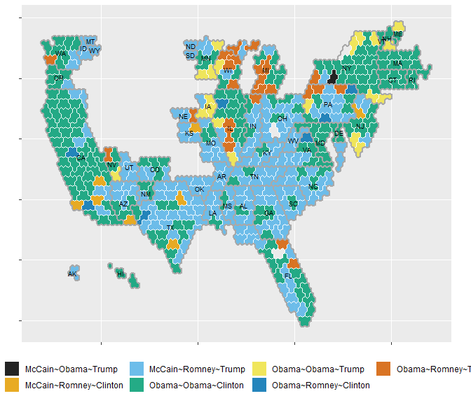

#### Tile map of US states

``` r
outer_url <- 'https://drive.google.com/uc?authuser=0&id=0B2X3Bx1aCHsJdGF4ZWRTQmVyV2s&export=download/TileOutv10.zip'

inner_url <- 'https://drive.google.com/uc?authuser=0&id=0B2X3Bx1aCHsJR1c0SzNyWlAtZjA&export=download/TileInv10.zip'

dailykos_tile <- lapply (c(inner_url, outer_url), get_url_shape)
names(dailykos_tile) <- c('inner', 'outer')
```

``` r
dailykos_tile$outer %>%
  ggplot() + 
  geom_sf(aes(fill = 'red'),
           color = 'black', alpha = .85) + 
    geom_sf(data=dailykos_tile$inner, 
          fill = NA, 
          show.legend = F, 
          color="black", 
          lwd=0.4) +
    ggsflabel::geom_sf_text(data = dailykos_tile$inner,
                                aes(label = State), size = 2.5) +
  #ggthemes::scale_fill_colorblind()+
  theme(axis.title.x=element_blank(),
        axis.text.x=element_blank(),
        axis.title.y=element_blank(),
        axis.text.y=element_blank(),
        legend.position = 'bottom')
```

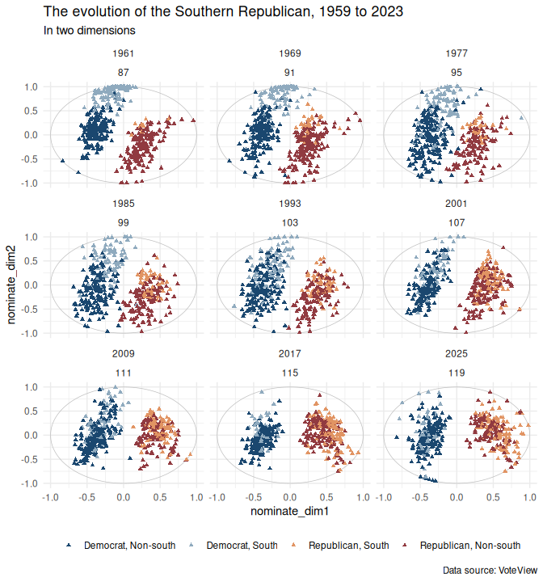

------------------------------------------------------------------------

### 7 Twitter

A nice [set of lists](https://twitter.com/cspan/lists) provided by C-SPAN.

``` r
rtweet::lists_members(slug = 'New-Members-of-Congress', owner_user = 'cspan') %>%
  head() %>%
  select(name, description) %>%
  formattable::formattable(align = c('l','l'))
```

<table class="table table-condensed">
<thead>
<tr>
<th style="text-align:left;">
name
</th>
<th style="text-align:left;">
description
</th>
</tr>
</thead>
<tbody>
<tr>
<td style="text-align:left;">
Lance Gooden
</td>
<td style="text-align:left;">
Husband, father, TX State Rep and Congressman-Elect for TX's 5th Congressional District.
</td>
</tr>
<tr>
<td style="text-align:left;">
Jahana Hayes for Congress
</td>
<td style="text-align:left;">
Congresswoman-Elect CT 5th Congressional District
</td>
</tr>
<tr>
<td style="text-align:left;">
Bryan Steil
</td>
<td style="text-align:left;">
Problem Solver. Badger. Manufacturing. Running for Congress. \#TeamSteil
</td>
</tr>
<tr>
<td style="text-align:left;">
Joe Morelle
</td>
<td style="text-align:left;">
\#NY25 Democratic candidate. Husband, father, believer in the promise of a future that is as strong, resilient & bold as the people who call Monroe County home.
</td>
</tr>
<tr>
<td style="text-align:left;">
John Joyce
</td>
<td style="text-align:left;">
Father, husband, granddad, doctor, advocate, PSU alum. Congressman-elect in \#PA13. Fighting everyday for central Pennsylvania. \#TeamJoyce
</td>
</tr>
<tr>
<td style="text-align:left;">
Kelly Armstrong
</td>
<td style="text-align:left;">
Lifelong North Dakotan. Proud husband and dad. Republican candidate for the U.S. House of Representatives.

Real Conservative. Real results.
</td>
</tr>
</tbody>
</table>
#### Gather some tweets.

``` r
ocasio_tweets <- rtweet::get_timeline('Ocasio2018', n = 500) %>%
  rename(doc_id=status_id) %>%
  filter(is_retweet == 'FALSE' & is_quote == 'FALSE')
```

#### Tweets as a corpus

For good measure, we annotate our tweet corpus to facilitate search for lexical and grammatical patterns. I have become a fan of using `udpipe` via `clanNLP` for annotation pruposes. Below we initiate the udpipe annotator.

``` r
library(cleanNLP)
library(corpuslingr)
cleanNLP::cnlp_init_udpipe(model_name="english",
                           feature_flag = FALSE,
                           parser = "none")
```

Next we annotate our corpus, and ready the corpus for search within the `corpuslingr` paradigm.

``` r
ocasio_annotated <-
  cleanNLP::cnlp_annotate(ocasio_tweets$text,
                          as_strings = TRUE,
                          doc_ids = ocasio_tweets$doc_id)$token %>%
  corpuslingr::clr_set_corpus(doc_var='id',
                              token_var='word',
                              lemma_var='lemma',
                              tag_var='pos',
                              pos_var='upos',
                              sentence_var='sid',
                              meta = ocasio_tweets[, c('doc_id', 'created_at')])
```

Then we do some searching.

``` r
search_results <- ocasio_annotated %>%
  corpuslingr::clr_search_context(search = 'HELP',
                                  LW=25, RW = 25)%>%
  corpuslingr::clr_context_kwic(include= c('created_at'))
  
DT::datatable(search_results, 
              options = list(pageLength = nrow(search_results), 
                             dom = 't'),
              class = 'cell-border stripe', 
              rownames = FALSE,
              width="100%", 
              escape=FALSE)
```

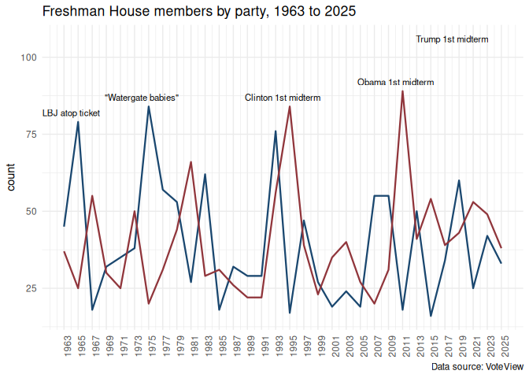

------------------------------------------------------------------------

### 8 A work in progress
