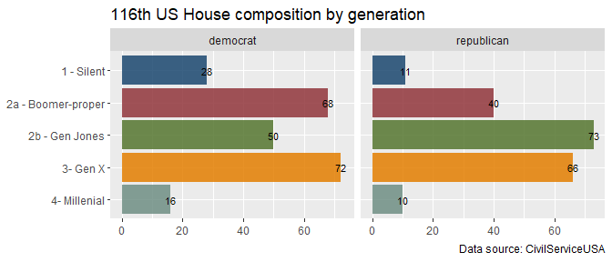
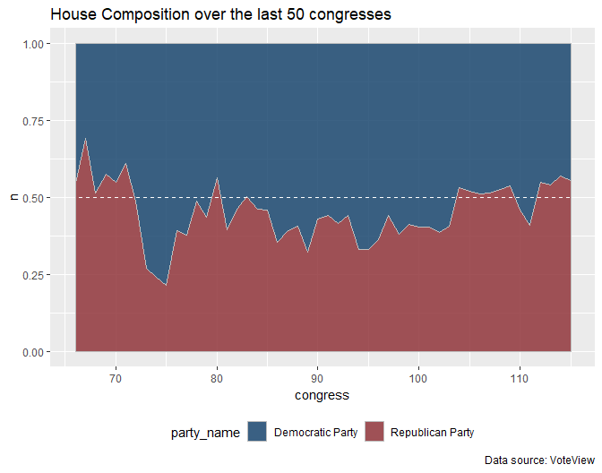
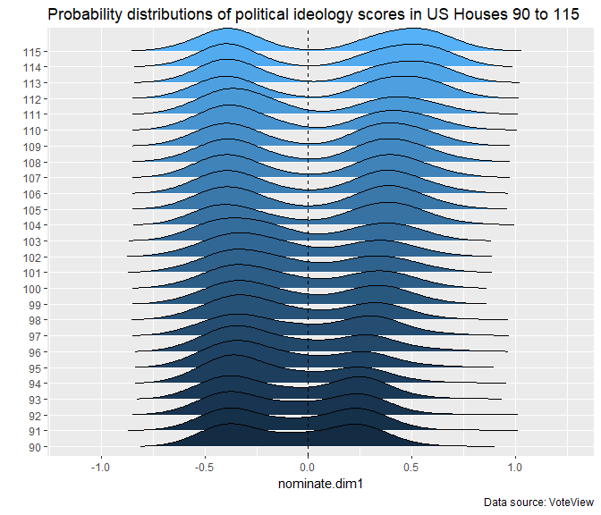
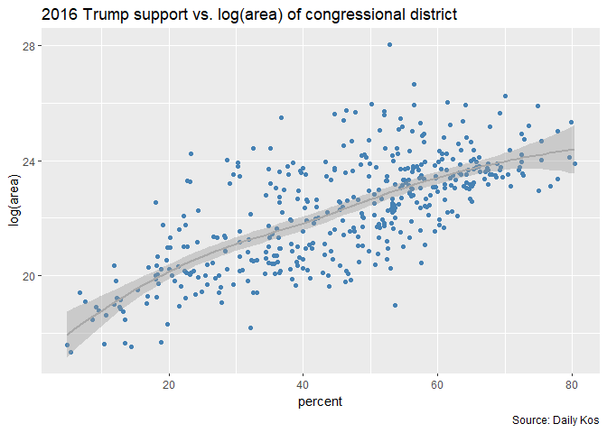
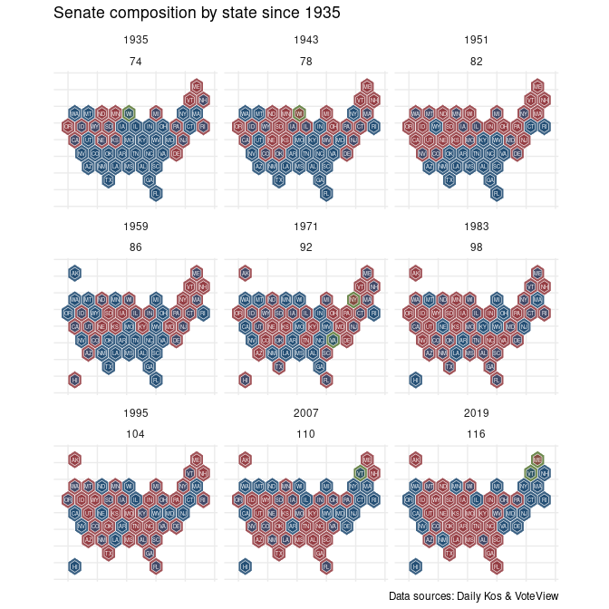
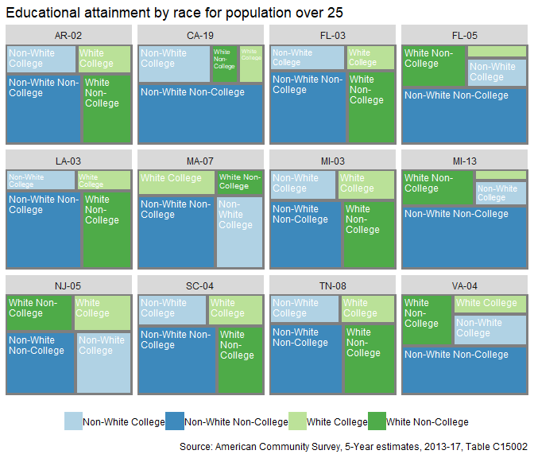
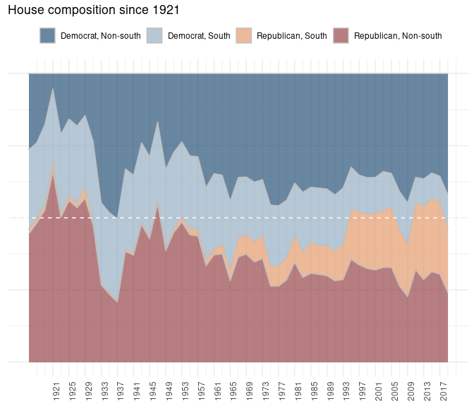
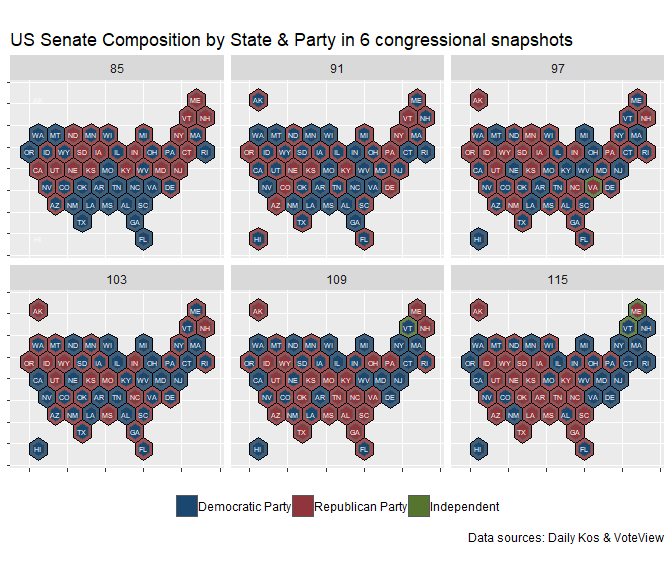
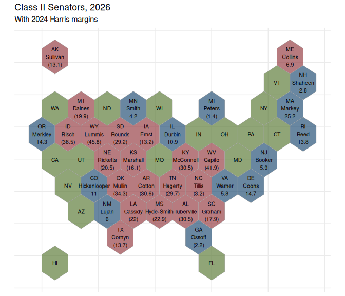
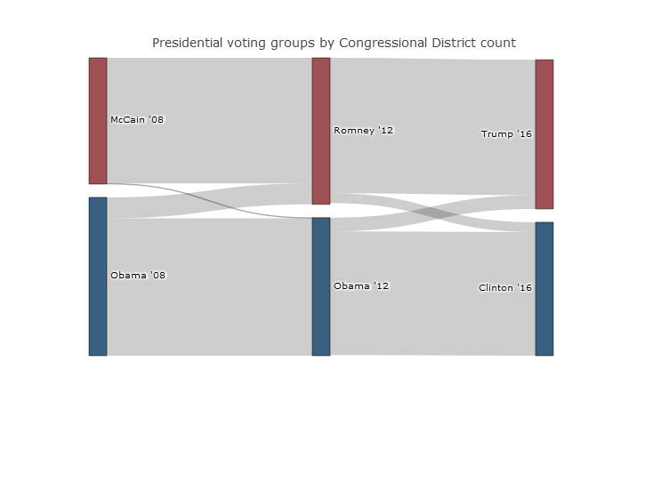

American political data & R: some open source resources & methods
-----------------------------------------------------------------

A layman's guide to accessing, integrating, and exploring US political data from a heterogenous collection of open government resources, including presidential election returns (2008-2016 by congressional district), lawmaker biographies & political ideologies, and congressional district demographics.

Data presented here have been collated from [The Daily Kos](), [CivilServiceUSA](), and the R packages [tidycensus]() & [Rvoteview]().

-   [1 Lawmaker details](#1-Lawmaker-details)
-   [2 Political Ideologies](#2-political-ideologies-and-congressional-composition)
-   [3 Political geometries](#4-political-geometries)
-   [4 Federal election results](#5-Federal-election-results)
-   [5 Census data and congressional districts](#6-Census-data-and-congressional-districts)
-   [6 Alternative geometries](#7-Funky-geometries)
-   [7 A work in progress](#8-A-work-in-progress)

Hopefully a useful open source framework for investigating past & future election results and congresses using R. All work presented here can be reproduced in its entirety. A developing resource.

``` r
library(tidyverse)
```

------------------------------------------------------------------------

### 1 Lawmaker details

> [CivilServiceUSA](https://github.com/CivilServiceUSA) provides a wonderful collection of details about each lawmaker in the 115th Congress, including age, race, religion, biographical details, and social media info. A full roll call of information available for each lawmaker is available [here](https://github.com/CivilServiceUSA/us-house#data-set). Here, we consider some different perspectives on the composition of the 115th House utilizing these data.

``` r
csusa_senate_dets <- jsonlite::fromJSON(url('https://raw.githubusercontent.com/CivilServiceUSA/us-senate/master/us-senate/data/us-senate.json'))
csusa_house_dets <- jsonlite::fromJSON(url('https://raw.githubusercontent.com/CivilServiceUSA/us-house/master/us-house/data/us-house.json'))
```

#### 1.1 Age & generational demographics of the 115th House

``` r
csusa_house_dets %>%
  mutate (years = 
            lubridate::year(as.Date(Sys.Date())) -
            lubridate::year(as.Date(date_of_birth))) %>%
  ggplot (aes(years)) +
  geom_histogram(bins=20, fill = 'steelblue', alpha = .85) +
  labs(title = '115th House composition by age',
       caption = 'Data source: CivilServiceUSA')
```


> [Pew Research](http://www.pewresearch.org/fact-tank/2018/04/11/millennials-largest-generation-us-labor-force/ft_15-05-11_millennialsdefined/) uses the following set of birth-year ranges to delineate generations.

-   Millenials: 1981-1997
-   Generation X: 1965 -1980
-   Baby Boomers: 1946-1964
-   Silent: 1928-1945
-   Greatest: &lt; 1928

> For good measure, we provide a more detailed classification of Boomers --- lumping folks born post-WWII with those born in the ~sixties is a problem for me. So, (a) Boomers-proper 1946-1954 & (b) [Generation Jones](https://en.wikipedia.org/wiki/Generation_Jones) 1955-1964.

``` r
gens115 <- csusa_house_dets %>%
  mutate (yob = as.numeric(gsub('-.*$', '', date_of_birth))) %>%
  mutate (gen = case_when (yob < 1998 & yob > 1980 ~ '4- Millenial',
                           yob < 1981 & yob > 1964 ~ '3- Gen X',
                           yob < 1965 & yob > 1954 ~ '2b - Gen Jones',
                           yob < 1955 & yob > 1945 ~ '2a - Boomer-proper',
                           yob < 1946 & yob > 1927 ~ '1 - Silent'))
gens115 %>%
  group_by(gen,party) %>%
  summarize(n=n()) %>%
  group_by(party) %>%
  mutate(rank = row_number())%>%
  ggplot(aes(x=reorder(gen, -rank), 
             y=n, 
             fill=gen)) + 
  geom_col(show.legend = FALSE, alpha = 0.85)+
  geom_text(aes(label = n), size = 3)+
  ggthemes::scale_fill_stata() +
  xlab(NULL) + ylab(NULL) +
  facet_wrap(~party) +
  coord_flip() +
  labs(title = '115th US House composition by generation',
       caption = 'Data source: CivilServiceUSA')
```


#### 1.2 Faith & the 115th House

``` r
cols <- RColorBrewer::brewer.pal(4, 'Set1') 
cols <- colorRampPalette(cols)(31)

csusa_house_dets %>%
  group_by(religion) %>%
  summarize(n = n()) %>%
  na.omit() %>%
    ggplot(aes(area = n,
               fill = religion,
               label = religion,
               subgroup = religion)) +
      treemapify::geom_treemap(alpha=.85) +
      treemapify::geom_treemap_subgroup_border() +
      treemapify::geom_treemap_text(colour = "white", 
                        place = "topleft", 
                        reflow = T,
                        size = 11)+
      scale_fill_manual(values = cols) +
      theme(legend.position = "none",
            #plot.title = element_text(size=12),
            legend.title=element_blank()) +
      labs(title = '115th House composition by religion',
           caption = 'Data source: CivilServiceUSA')
```



------------------------------------------------------------------------

### 2 Political ideologies and congressional composition

> The [VoteView](https://voteview.com/) project provides roll call-based political ideology scores for all lawmakers in the history of the US Congress. Data can be used to investigate congressional composition by party affiliation over time, the aggregate political ideologies of both houses over time, and the ideologies of individual lawmakers. Plus a host of other roll call-based analyses.

``` r
rvoteview_house_50 <- lapply(c(66:115), function (x)
                    Rvoteview::member_search (
                      chamber = 'House', 
                      congress = x)) %>% 
  bind_rows() %>%
  mutate(name = paste0 (gsub(', .*$', '', bioname), ' ', cqlabel))
```

#### 2.1 Congressional composition

``` r
rvoteview_house_50 %>%
  filter(party_name %in% c('Democratic Party', 'Republican Party')) %>%
  group_by(congress, party_name) %>%
  summarize(n = n()) %>%
  mutate(n = n/sum(n)) %>%
  ggplot(aes(x=congress, y=n, fill = party_name)) +
  geom_area(alpha = 0.85, color = 'gray') +
  ggthemes::scale_fill_stata()+
  geom_hline(yintercept = 0.5, color = 'white', linetype = 2) +
  annotate("text", x = 73, y = .9, label = "Democrats", 
           color = 'white',
           size = 4) +
  annotate("text", x = 73, y = .1, label = "Republicans", 
           color = 'white',
           size = 4) +
  theme(legend.position = "none")+
  labs(title = "House Composition over the last 50 congresses",
       caption = 'Data source: VoteView')
```



#### 2.2 Political ideologies

> Ideological extremes in the 111th US Congress.

``` r
extremes <- rvoteview_house_50 %>%
  filter(congress == 111) %>%
  select(name, party_name, nominate.dim1, nominate.dim2) %>%
  gather (key =dim, value = estimate,
          nominate.dim1:nominate.dim2) %>%
  group_by(party_name,dim) %>%
  filter(estimate == max((estimate)) | 
           estimate == min((estimate)))
```

Plot.

``` r
rvoteview_house_50 %>%
  filter (congress == 111) %>%
  ggplot(aes(x=nominate.dim1, 
             y=nominate.dim2, 
             label = name
             )) +
          annotate("path",
               x=cos(seq(0,2*pi,length.out=300)),
               y=sin(seq(0,2*pi,length.out=300)),
               color='gray',
               size = .25) +
  geom_point(aes(color = as.factor(party_code)), 
             size= 2, 
             shape= 17) +
  ggrepel::geom_text_repel(
    data  = filter(rvoteview_house_50, 
                   congress==111,
                   name %in% extremes$name),
    nudge_y =  -0.025,
    direction = "y",
    hjust = 0, size = 2.5) +
  ggthemes::scale_color_stata() +
  theme(legend.position = 'none') +
  labs(title="DW-Nominate ideology scores for the 111th US House",
       caption = 'Data source: VoteView')
```


#### 2.3 Political ideologies historically

``` r
rvoteview_house_50 %>%
  filter(congress > 89) %>%
    ggplot(aes(x=nominate.dim1, y=as.factor(congress), fill = congress)) +
    ggridges::geom_density_ridges(rel_min_height = 0.01) +
    geom_vline(xintercept = 0, color = 'black', linetype = 2) +
    theme(legend.position = "none") + 
    ylab("")+
    labs(title = "Probability distributions of political ideology scores in US Houses 90 to 115",
         caption = 'Data source: VoteView')
```



#### 2.4 NOKKEN & POOLE scores

An alternative approach. --- Voteview data with

(that change per congress). Scores via `Rvoteview` only DW\_Nominate, which reflect an aggregate score based on lawmaker's entire voting history (eben if they switch houses, which is weird).

Mention the `bioguide` which helps cross.

``` r
voteview_house115 <- read.csv(url("https://voteview.com/static/data/out/members/HSall_members.csv"),
  stringsAsFactors = FALSE) %>%
  filter(chamber == 'House' & congress == 115)
```

------------------------------------------------------------------------

### 3 Political geometries

> The `tigris` package provides a super convenient interface ... for loading US shapefiles ...

``` r
nonx <- c('78', '69', '66', '72', '60', '15', '02')

library(tigris); options(tigris_use_cache = TRUE, tigris_class = "sf")
us_house_districts <- tigris::congressional_districts(cb = TRUE) %>%
  select(GEOID,STATEFP, CD115FP) %>%
  
  left_join(tigris::states(cb = TRUE) %>% 
              data.frame() %>%
              select(STATEFP, STUSPS)) 

laea <- sf::st_crs("+proj=laea +lat_0=30 +lon_0=-95") # Lambert equal area
us_house_districts <- sf::st_transform(us_house_districts, laea)
```

------------------------------------------------------------------------

### 4 Federal election results

> [Daily Kos data sets](https://www.dailykos.com/stories/2018/2/21/1742660/-The-ultimate-Daily-Kos-Elections-guide-to-all-of-our-data-sets)

Not fantastic structure-wise. Some lawmaker bio details (Name, First elected, Birth Year, Gender, RAce/ethnicity, Religion, LGBT). House sheet: 2016/2012/2008 presidential election results by congressional district; along with 2016/2014 house congressional results; No 2018 results.

Also includes some socio-dems by district, but this is likely more easily addressed using `tidycensus`.

#### 4.1 Restructuring election data

``` r
url <- 'https://docs.google.com/spreadsheets/d/1oRl7vxEJUUDWJCyrjo62cELJD2ONIVl-D9TSUKiK9jk/edit#gid=1178631925'

house <- gsheet::gsheet2tbl(url) 
```

Data are super dirty. A simple cleaning procedure that will scale (for the most part) to other data sources at the Daily Kos. With a simple focus on ... :

``` r
fix <- as.data.frame(cbind(colnames(house), as.character(house[1,])), 
  string_as_factor = FALSE) %>%
  mutate(V1 = gsub('^X', NA, V1)) %>%
  fill(V1) %>%
  mutate(nw_cols = ifelse(is.na(V2), V1, paste0(V1, '_', V2)),
         nw_cols = gsub(' ', '_', nw_cols))

colnames(house) <- fix$nw_cols
house <- house %>% slice(3:nrow(.))
keeps <- house[,!grepl('Pronun|ACS|Census|Survey', colnames(house))]
```

Here we filter to data to the last three Presidential elections.

``` r
dailykos_pres_elections <- keeps [,c('District', 'Code', grep('President_[A-z]', colnames(house), value=T))] %>%
  gather (key = election, value = percent, `2016_President_Clinton`:`2008_President_McCain`) %>%
  mutate(election = gsub('President_', '', election),
         percent = as.numeric(percent)) %>%
  separate(Code, c('STUSPS', 'CD115FP')) %>%
  separate(election, c('year', 'candidate'))%>%
  mutate(CD115FP = ifelse(CD115FP == 'AL', '00', CD115FP)) %>%
  left_join(data.frame(us_house_districts) %>% select (-geometry))
```

Our new data.

``` r
dailykos_pres_elections %>%
  select(District, GEOID, year, candidate, percent) %>%
  head() %>%
  knitr::kable()
```

| District    | GEOID | year | candidate |  percent|
|:------------|:------|:-----|:----------|--------:|
| Alabama 1st | 0101  | 2016 | Clinton   |     34.1|
| Alabama 2nd | 0102  | 2016 | Clinton   |     33.0|
| Alabama 3rd | 0103  | 2016 | Clinton   |     32.3|
| Alabama 4th | 0104  | 2016 | Clinton   |     17.4|
| Alabama 5th | 0105  | 2016 | Clinton   |     31.3|
| Alabama 6th | 0106  | 2016 | Clinton   |     26.1|

#### 4.2 Presidential Election results - 2016

``` r
us_house_districts %>%
  filter(!gsub('..$' ,'', GEOID) %in% nonx) %>%
  left_join(dailykos_pres_elections %>% 
              filter(year == '2016') %>%
              spread(candidate, percent) %>%
              mutate(Margin = Trump-Clinton)) %>%
  ggplot() + 
  geom_sf(aes(fill = Margin)) +
  scale_fill_distiller(palette = "RdBu",direction=-1)+
  theme(axis.title.x=element_blank(),
        axis.text.x=element_blank(),
        axis.title.y=element_blank(),
        axis.text.y=element_blank(),
        legend.position = 'bottom') +
  labs(title = "Trump vote margins by congressional district",
       caption = 'Data source: Daily Kos')
```



#### 4.3 Rural & urban voting

Using the area of congressional districts (in log square meters) as a proxy for degree of urbanity. ... Plot Trump support as function of CD area.

``` r
us_house_districts %>%
  left_join(dailykos_pres_elections %>% 
              filter(year == '2016') %>%
              spread(candidate, percent) %>%
              mutate(Margin = Trump-Clinton)) %>%
  mutate(area = as.numeric(gsub(' m^2]', '', sf::st_area(.)))) %>%
  ggplot(aes(Margin, log(area))) +
  geom_point(color = 'steelblue') +
  geom_smooth(method="loess", se=T, color = 'darkgrey')+
  labs(title = "Trump vote margins vs. log(area) of congressional district",
       caption = 'Data source: Daily Kos')
```



------------------------------------------------------------------------

### 5 Census data and congressional districts

> Using `tidycensus` ... Investigating educational attainment by race.

#### 5.1 Acquire census data

Census race/ethnicity per US Census classifications.

``` r
code <- c('A', 'B', 'C', 'D', 'E',
          'F', 'G', 'H', 'I')
          
          
race <- c('WHITE ALONE', 'BLACK OR AFRICAN AMERICAN ALONE',
          'AMERICAN INDIAN OR ALASKAN NATIVE ALONE',
          'ASIAN ALONE', 
          'NATIVE HAWAIIAN AND OTHER PACIFIC ISLANDER ALONE', 
          'SOME OTHER RACE ALONE', 'TWO OR MORE RACES',
          'WHITE ALONE, NOT HISPANIC OR LATINO',
          'HISPANC OR LATINO')

race_table <- as.data.frame(cbind(code,race),
                            stringsAsFactors=FALSE)
```

C15002: SEX BY EDUCATIONAL ATTAINMENT FOR THE POPULATION 25 YEARS AND OVER

``` r
search_vars <- var_list[grepl('C1500', var_list$name),]

tidycens_data <- tidycensus::get_acs(geography = 'congressional district',
                            variables = search_vars$name,
                            summary_var = 'B15002_001',
                            year = 2017,
                            survey = 'acs5') %>%
  left_join(search_vars %>% rename(variable = name)) %>%
  filter(!grepl('Total$|Female$|Male$', label)) %>%
  
  mutate(gender = ifelse(grepl('Male', label), 'Male', 'Female'),
         label = gsub('^Estimate.*!!', '', label),
         code = gsub('(C[0-9]+)([A-Z])(_[0-9]+.$)', 
                     '\\2', 
                     variable)) %>%
  left_join (race_table) %>%
  select(GEOID, label, gender, race, estimate:summary_moe)
```

#### 5.2 The White working class

White men without college degree. As percentage of total population over 25. ie, as a percentage of the electorate.

``` r
us_house_districts %>% 
  filter(!gsub('..$' ,'', GEOID) %in% nonx) %>%
  left_join(tidycens_data %>% 
              filter(label != 'Bachelor\'s degree or higher' &
                     #gender == 'Male' & 
                     race == 'WHITE ALONE, NOT HISPANIC OR LATINO')%>%
              group_by(GEOID) %>%
              summarize(estimate = sum(estimate), 
                        summary_est = mean(summary_est))) %>%
  mutate(per = estimate / summary_est) %>%
  ggplot() + 
  geom_sf(aes(fill = per)) + 
  
  scale_fill_distiller(palette = "BrBG", direction=1)+
  
  theme(axis.title.x=element_blank(),
        axis.text.x=element_blank(),
        axis.title.y=element_blank(),
        axis.text.y=element_blank(),
        legend.position = 'bottom') +
  labs(title = "White working class (%) by congressional district",
       caption = 'Source: American Community Survey, 5-Year estimates, 2013-17, Table C15002')
```



#### 5.3 Educational attainment profiles by CD

Create plots of some cherry-picked district cross-sections (per Daily Kos).

Definitions: WHITE ALONE means/equals all the whites, hispanic or otherwise. OR, WHITE ALONE, HISPANIC + WHITE ALONE, NOT HISPANIC.

``` r
tree <- tidycens_data %>%
  left_join(data.frame(us_house_districts) %>% select(GEOID, STUSPS, CD115FP)) %>%
  mutate (race = gsub(', | ', '_', race)) %>%
  select(-moe:-summary_moe) %>%
  spread(race, estimate) %>%
  mutate(WHITE_ALONE_HISPANIC = WHITE_ALONE - WHITE_ALONE_NOT_HISPANIC_OR_LATINO) %>%
  gather(key =race, value = estimate, AMERICAN_INDIAN_OR_ALASKAN_NATIVE_ALONE:WHITE_ALONE_HISPANIC) %>%
  filter(race != 'HISPANIC OR LATINO') %>%
  mutate(race_cat = ifelse(race == 'WHITE_ALONE_NOT_HISPANIC_OR_LATINO', 'White', 'Non-White'),
    ed_cat = ifelse(label == 'Bachelor\'s degree or higher', 'College', 'Non-College'))%>%
  group_by(GEOID, STUSPS, CD115FP, race_cat, ed_cat) %>%
  summarize(estimate = sum(estimate)) %>%
  group_by(GEOID) %>%
  mutate(per = estimate/sum(estimate)) %>%
  ungroup()
```

thoughts.

``` r
samp_n <- sample(unique(tree$GEOID), 12)

tree %>%
  filter(GEOID %in% samp_n) %>%
    ggplot(aes(area = per,
               fill = paste0(race_cat, ' ', ed_cat),
               label = paste0(race_cat, ' ', ed_cat),
               subgroup = paste0(race_cat, ' ', ed_cat)))+
      treemapify::geom_treemap(alpha=.85)+
      treemapify::geom_treemap_subgroup_border() +

      treemapify::geom_treemap_text(colour = "white", 
                        place = "topleft", 
                        reflow = T,
                        size = 9)+
      #ggthemes::scale_fill_stata()+ 
      scale_fill_brewer(palette = 'Paired') +
      facet_wrap(~paste0(STUSPS, '-', CD115FP)) +
      theme(legend.position = "bottom",
            legend.title=element_blank()) + 
      labs(title = "Educational attainment by race for population over 25",
           subtitle = 'A random sample of congressional districts',
           caption = 'Source: American Community Survey, 5-Year estimates, 2013-17, Table C15002')
```


#### 5.4 Trump support by educational attainment

Trump ed/race dems by binned degrees of support.

``` r
ed_45 <- dailykos_pres_elections %>%
  filter(candidate == 'Trump') %>%
  group_by(candidate) %>%
  mutate(cut = cut_number(percent, n =10),
         rank_cut = dense_rank(cut)) 
```

A summary of congressional districts:

``` r
table(ed_45$cut)
```

    ## 
    ##  [4.9,21.4] (21.4,30.5] (30.5,36.6] (36.6,43.1] (43.1,48.7] (48.7,53.1] 
    ##          44          46          42          42          45          42 
    ## (53.1,56.2] (56.2,60.9] (60.9,65.6] (65.6,80.4] 
    ##          44          44          42          44

Describe plot. The average educational attainment profile for each level (ie, bin) of support for 45.

``` r
ed_45 %>%
  left_join(tree) %>%
  mutate(type = paste0(race_cat, ' ', ed_cat)) %>%
  select(type, rank_cut, cut, estimate) %>%
  group_by(type, cut, rank_cut) %>%
  summarize(estimate = sum(estimate)) %>%
  group_by(cut)%>%
  mutate(new_per = estimate/sum(estimate)) %>%
  
ggplot(aes(x=(rank_cut), y=new_per, fill = type)) +
  geom_area(alpha = 0.75, color = 'gray') +
  scale_fill_brewer(palette = 'Paired') +
  scale_x_continuous(breaks = 1:10, labels = 1:10) + 
  theme(legend.position = "bottom")+
  labs(title = "Educational attainment profiles by level of support for 45",
       subtitle = '2016 Presidential Election')+
  xlab('Level of support for 45')+ylab(NULL)
```



------------------------------------------------------------------------

### 6 Alternative political geometries

> The Daily Kos makes available of set of shapefiles meant to represent congressional districts and states as .... The Daily Vos makes these shapefiles availble via Google Drive. Links are provided below.

``` r
#Hex map
dailyvos_hex_cd <- 'https://drive.google.com/uc?authuser=0&id=1E_P0r1Uv438fZsvKsvidIR02Nb5Ju9zf&export=download/HexCDv12.zip'
dailyvos_hex_st <- 'https://drive.google.com/uc?authuser=0&id=0B2X3Bx1aCHsJVWxYZGtxMGhrMEE&export=download/HexSTv11.zip'
#Tile map
dailyvos_tile_outer <- 'https://drive.google.com/uc?authuser=0&id=0B2X3Bx1aCHsJdGF4ZWRTQmVyV2s&export=download/TileOutv10.zip'
dailyvos_tile_inner <- 'https://drive.google.com/uc?authuser=0&id=0B2X3Bx1aCHsJR1c0SzNyWlAtZjA&export=download/TileInv10.zip'
```

#### 6.1 A simple function for shapefile extraction

We first build a simple function that ... Download & load shapefile as an `sf` object -- as process.

``` r
get_url_shape <- function (url) {
  temp <- tempdir()
  zip_name <- paste0(temp, '\\', basename(url))
  download.file(url, zip_name, 
                quiet = TRUE)
  unzip(zip_name, exdir = temp)
  x <- sf::st_read(dsn = gsub('\\.zip', '', zip_name), 
                   layer = gsub('\\.zip','', basename(url)),
                   quiet = TRUE) 
  unlink(temp) 
  x}
```

#### 6.2 Tile map of US states

Extract shapefiles from ...

``` r
dailykos_tile <- lapply (c(dailyvos_tile_inner,
                           dailyvos_tile_outer),
                         get_url_shape)
names(dailykos_tile) <- c('inner', 'outer')
```

Senators by state by part.

``` r
sens <- rvoteview_senate_50 %>%
  mutate(party_name = factor(party_name, levels =c('Democratic Party', 
                                         'Republican Party', 
                                         'Independent'))) %>%
  filter(congress %in% c(85, 91, 97, 103, 109, 115)) %>%
  arrange (state_abbrev, party_name) %>%
  group_by(congress, state_abbrev) %>%
  mutate(layer = row_number())%>%
  rename(State = state_abbrev) %>%
  select(congress, State, party_name, layer)
```

Plot. To address the consistency issue. Group by aplhabetical order -- such that if D-R, then D placed in inner. Independents?

``` r
dailykos_tile$outer %>% 
  left_join(sens %>% filter (layer == 2)) %>%
  ggplot() + 
  geom_sf(aes(fill = party_name),
          color = 'black', 
          alpha = .85) + 
  geom_sf(data = dailykos_tile$inner %>%
            left_join(sens %>% filter (layer == 1)), 
          aes(fill = party_name)) +
  ggsflabel::geom_sf_text(data = dailykos_tile$inner,
                          aes(label = State), 
                          size = 1.75,
                          color = 'white') +
  ggthemes::scale_fill_stata()+
  theme(axis.title.x=element_blank(),
        axis.text.x=element_blank(),
        axis.title.y=element_blank(),
        axis.text.y=element_blank(),
        legend.title=element_blank(),
        legend.position = 'bottom') +
  facet_wrap(~congress) +
  labs(title = "US Senate Composition by Congress, State & Party: Snapshots",
       caption = 'Data sources: Daily Kos & VoteView')
```



#### 6.3 Hexmap of Congressional districs

Apply function.

``` r
dailykos_shapes <- lapply (c(dailyvos_hex_cd, dailyvos_hex_st), 
                           get_url_shape)
names(dailykos_shapes) <- c('cds', 'states')
#State hex shapefile is slightly broken.
dailykos_shapes$states <- lwgeom::st_make_valid(dailykos_shapes$states)
```

Here, we consider Presidential voting ...

``` r
dailykos_pres_flips <- dailykos_pres_elections %>%
  group_by(District, year) %>%
  filter(percent == max(percent))%>%
  
  mutate(dups = n()) %>%
  filter(dups != 2) %>% #Kill ties --> n = 3
  
  select(-percent, -dups) %>% #
  arrange(District) %>%
  spread(year, candidate) 

#Some hand edits to address percentage "ties" 
dailykos_pres_flips$`2012`[dailykos_pres_flips$District == 'Florida 7th'] <- 'Obama' 
dailykos_pres_flips$`2008`[dailykos_pres_flips$District == 'Ohio 10th'] <- 'Obama' 
dailykos_pres_flips$`2008`[dailykos_pres_flips$District == 'New York 22nd'] <- 'McCain'
```

Some hand edits to address ties.

``` r
dailykos_pres_flips <- dailykos_pres_flips %>%
  mutate(flips = paste0(`2008`, '-',`2012`, '-', `2016`)) %>%
  group_by(flips) %>%
  mutate(sum = n()) %>%
  ungroup()
```

Summary

``` r
dailykos_pres_flips %>%
  group_by(flips) %>%
  summarize(n = n()) %>%
  arrange(desc(n)) %>%
  ggplot(aes(x=reorder(flips, n), 
             y=n, 
             fill=reorder(flips, -n))) + 
  geom_col(show.legend = FALSE, alpha = 0.85)+
  geom_text(aes(label = n), size = 3)+
  ggthemes::scale_fill_stata() +
  xlab(NULL) + ylab(NULL) +
  coord_flip() +
  labs(title = 'Presidential winner lineages - 2008-16',
       caption = 'Data source: Daily Kos')
```


Note that this has been reproduced.

``` r
dailykos_shapes$cds %>%
  inner_join(dailykos_pres_flips)%>%
  ggplot() + 
  geom_sf(aes(fill = reorder(flips, -sum)),
          color = 'gray', 
          alpha = .85) + 
  geom_sf(data=dailykos_shapes$states, 
          fill = NA, 
          show.legend = F, 
          color="black", 
          lwd=.7) +
  ggsflabel::geom_sf_text(data = dailykos_shapes$states,
                          aes(label = STATE), 
                          size = 2.75,
                          color='white',
                          face='bold') +
  ggthemes::scale_fill_stata()+
  theme(axis.title.x=element_blank(),
        axis.text.x=element_blank(),
        axis.title.y=element_blank(),
        axis.text.y=element_blank(),
        legend.title=element_blank(),
        legend.position = 'bottom') +
  labs(title = "Presidential election results by district - 2008, 2012 & 2016",
       caption = 'Data source: Daily Kos')
```



#### 6.4 Another perspective

``` r
dailykos_pres_flips %>%
  mutate(f08_12 = paste0(`2008`,'_', `2012`),
         f12_16 = paste0(`2012`,'_', `2016`))%>%
  select(District, f08_12, f12_16) %>%
  gather(elect, flip, -District) %>%
  group_by(elect, flip) %>%
  summarize(value=n()) %>%
  separate(flip, c('source', 'target'), sep = '_') %>%
  separate(elect, c('e1', 'e2'), sep = '_') %>%
  mutate(source = paste0(source, ' ', gsub('f','', e1)),
         target = paste0(target, ' ', e2)) %>%
  select(-e1, -e2) %>%
  knitr::kable()
```

| source    | target     |  value|
|:----------|:-----------|------:|
| McCain 08 | Obama 12   |      1|
| McCain 08 | Romney 12  |    192|
| Obama 08  | Obama 12   |    210|
| Obama 08  | Romney 12  |     32|
| Obama 12  | Clinton 16 |    190|
| Obama 12  | Trump 16   |     21|
| Romney 12 | Clinton 16 |     15|
| Romney 12 | Trump 16   |    209|

A sankey diagram. Clearly a bit jazzier as an html widget proper.

``` r
library(plotly)
r<- '#9e5055'; b <- '#395f81'
plot_ly(
    type = "sankey",
    orientation = "h",
    node = list(
      label = c("McCain '08", "Obama '08", "Romney '12", 
                "Obama '12", "Trump '16", "Clinton '16"),
      color = c(r, b, r, b, r, b),
      pad = 15,
      thickness = 20,
      line = list(color = "black", width = 0.5)),
    
    link = list(
      source = c(0,0,1,1,3,3,2,2),
      target = c(3,2,3,2,5,4,5,4),
      value =  c(1,192,210,32,189,21,15,207))) %>% 
  
    layout(
      title = "Presidential support by Congressional District count",
      font = list(size = 10))
```



------------------------------------------------------------------------

### 7 A work in progress

Indeed, a work in progress. But hopefully a nice round-up of useful open source resources for invewstigating & visualizing federal election results. I would love to here about additional/alternative open source resources!
