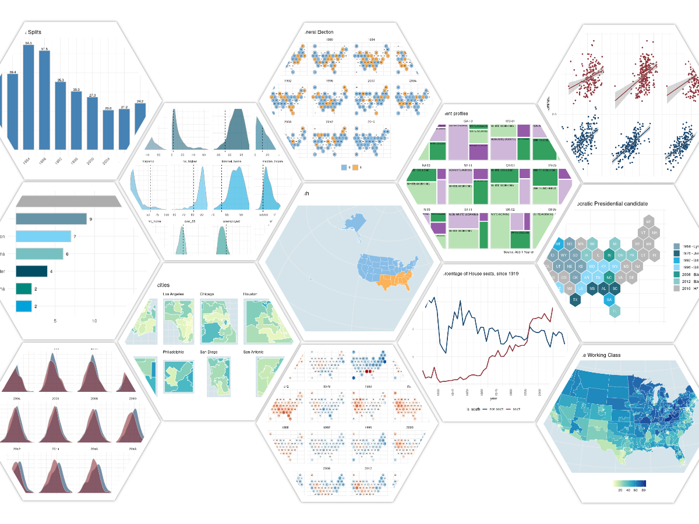
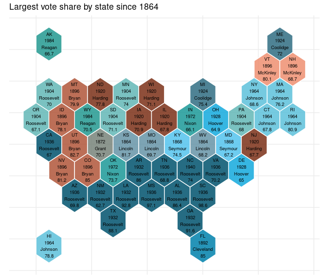
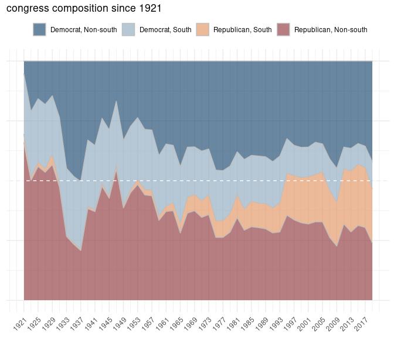
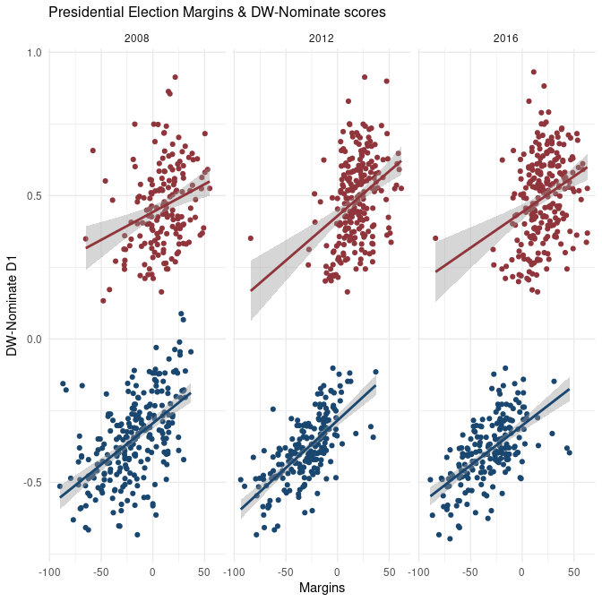
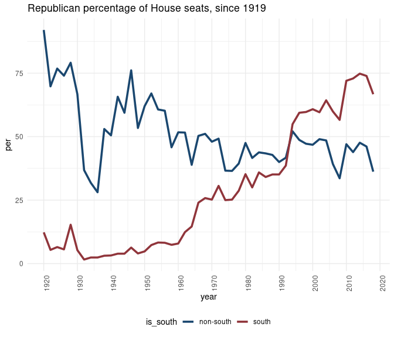
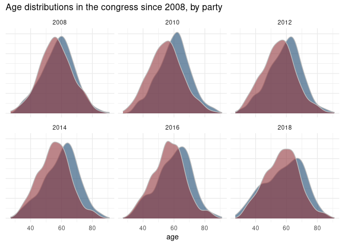
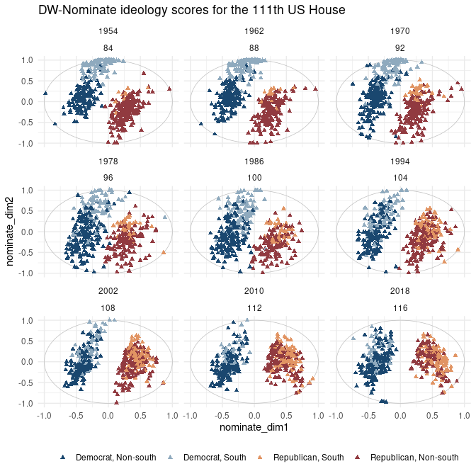
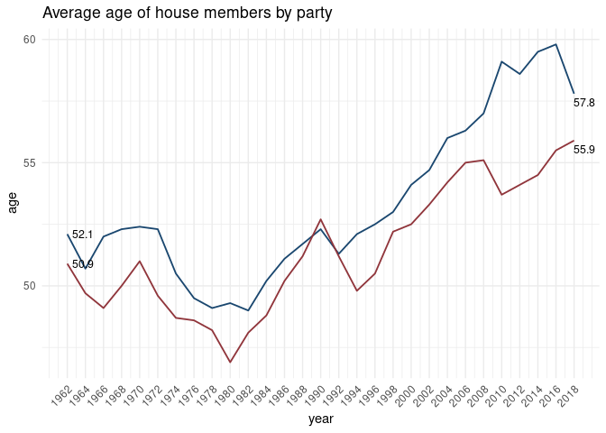
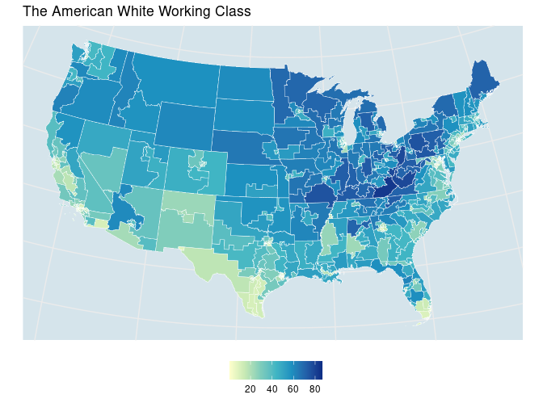
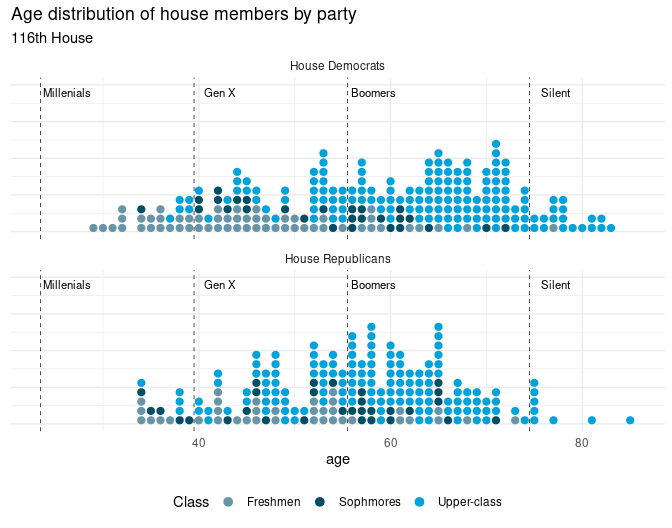

American political data & R
===========================

An open-source guide to … (apdr)

*Updated: 2020-10-25*



``` r
library(tidyverse)
```

``` r
# leg_dets <- 'https://theunitedstates.io/congress-legislators/legislators-current.csv'
# twitters <- read.csv((url(leg_dets)), stringsAsFactors = FALSE) %>%
#   rename (state_abbrev = state, district_code = district)
```

### A simple add-on map theme

``` r
# not really a guide -- but adds for mapping in theme_minimal()
theme_guide <- function () {
  
    theme(axis.title.x=element_blank(), 
          axis.text.x=element_blank(),
          axis.title.y=element_blank(),
          axis.text.y=element_blank(),
          legend.title=element_blank(),
          legend.position = 'none', 
          complete = F)
}
```

### Some geo-spatial data

``` r
library(sf)
library(tigris)
options(tigris_use_cache = TRUE, tigris_class = "sf")

nonx <- c('78', '69', '66', '72', '60', '15', '02')

states_sf <- tigris::states(cb = TRUE) %>%
  rename(state_code = STATEFP, state_abbrev = STUSPS)

states <- states_sf %>%
  data.frame() %>%
  select(state_code, state_abbrev)
  
uscds <- tigris::congressional_districts(cb = TRUE) %>%
  select(GEOID) %>%
  mutate(CD_AREA = round(log(as.numeric(
    gsub(' m^2]', '', sf::st_area(.)))), 2)) %>%
  # calculate cd area --
  
  mutate(state_code = substr(GEOID, 1, 2),
         district_code = substr(GEOID, 3, 4)) 

laea <- sf::st_crs("+proj=laea +lat_0=30 +lon_0=-95") 
# Lambert equal area
#uscds  <- sf::st_transform(uscds , laea)
```

On impeachment
--------------

### VoteView: Legislation & roll calls

Fifteen US Senators served in the impeachment trials of both President
Clinton in 1999 and President Trump in 2020. Here we take a quick look
at how they voted using the `Rvoteview` package.

The table below summarizes impeachment roll calls for the two 1999
articles & the two 2020 articles. There was also a resolution to censure
President Clinton. (Note that Mitt Romney (UT) voted in support of
Article I and against Article II in the 2020 impeachment trial of
President Trump.)

``` r
res <- Rvoteview::voteview_search("impeachment") %>%
  filter(chamber == 'Senate' & 
           date %in% c('2020-02-05', '1999-02-12')) %>%
  select(id, date, bill_number, text, question, yea, nay) %>%
  arrange(date) 
```

``` r
res %>%
  select(-id, -bill_number) %>%
  mutate(article = c('-', 'I', 'II', 'II', 'I')) %>%
  arrange(date, article) %>%
  knitr::kable()
```

<table style="width:100%;">
<colgroup>
<col style="width: 6%" />
<col style="width: 70%" />
<col style="width: 12%" />
<col style="width: 2%" />
<col style="width: 2%" />
<col style="width: 4%" />
</colgroup>
<thead>
<tr class="header">
<th style="text-align: left;">date</th>
<th style="text-align: left;">text</th>
<th style="text-align: left;">question</th>
<th style="text-align: right;">yea</th>
<th style="text-align: right;">nay</th>
<th style="text-align: left;">article</th>
</tr>
</thead>
<tbody>
<tr class="odd">
<td style="text-align: left;">1999-02-12</td>
<td style="text-align: left;">A resolution relating to the censure of William Jefferson Clinton.</td>
<td style="text-align: left;">On the Motion</td>
<td style="text-align: right;">43</td>
<td style="text-align: right;">56</td>
<td style="text-align: left;">-</td>
</tr>
<tr class="even">
<td style="text-align: left;">1999-02-12</td>
<td style="text-align: left;">A resolution impeaching William Jefferson Clinton, President of the United States, for high crimes and misdemeanors.</td>
<td style="text-align: left;">Guilty or Not Guilty</td>
<td style="text-align: right;">50</td>
<td style="text-align: right;">51</td>
<td style="text-align: left;">I</td>
</tr>
<tr class="odd">
<td style="text-align: left;">1999-02-12</td>
<td style="text-align: left;">A resolution impeaching William Jefferson Clinton, President of the United States, for high crimes and misdemeanors.</td>
<td style="text-align: left;">Guilty or Not Guilty</td>
<td style="text-align: right;">45</td>
<td style="text-align: right;">56</td>
<td style="text-align: left;">II</td>
</tr>
<tr class="even">
<td style="text-align: left;">2020-02-05</td>
<td style="text-align: left;">A resolution impeaching Donald John Trump, President of the United States, for high crimes and misdemeanors.</td>
<td style="text-align: left;">Guilty or Not Guilty</td>
<td style="text-align: right;">47</td>
<td style="text-align: right;">53</td>
<td style="text-align: left;">I</td>
</tr>
<tr class="odd">
<td style="text-align: left;">2020-02-05</td>
<td style="text-align: left;">A resolution impeaching Donald John Trump, President of the United States, for high crimes and misdemeanors.</td>
<td style="text-align: left;">Guilty or Not Guilty</td>
<td style="text-align: right;">48</td>
<td style="text-align: right;">52</td>
<td style="text-align: left;">II</td>
</tr>
</tbody>
</table>

Here we look at how the 15 US Senators – members of both the 106th &
116th congresses – voted on Article I from the 2020 trial and Article II
of the 1999 trial.

``` r
votes <- Rvoteview::voteview_download(res$id)
```

``` r
sens <- Rvoteview:: member_search(chamber= 'Senate', 
                                  congress = c(106, 116))  
## re-do this piece --         

votes$votes.long %>% 
  inner_join(sens %>% 
               mutate(icpsr = as.character(icpsr))) %>%
  filter(vname %in% c('RS1060018', 'RS1160461')) %>%
  select(bioname, state_abbrev, 
         congress, party_name, vote) %>%
  mutate(vote = ifelse(vote == 1, 'Yea', 'Nay')) %>%
  spread(congress, vote) %>%
  filter(complete.cases(.)) %>%
  arrange(party_name, `106`) %>%
  knitr::kable()
```

| bioname                             | state\_abbrev | party\_name      | 106 | 116 |
|:------------------------------------|:--------------|:-----------------|:----|:----|
| DURBIN, Richard Joseph              | IL            | Democratic Party | Nay | Yea |
| FEINSTEIN, Dianne                   | CA            | Democratic Party | Nay | Yea |
| LEAHY, Patrick Joseph               | VT            | Democratic Party | Nay | Yea |
| MURRAY, Patty                       | WA            | Democratic Party | Nay | Yea |
| REED, John F. (Jack)                | RI            | Democratic Party | Nay | Yea |
| SCHUMER, Charles Ellis (Chuck)      | NY            | Democratic Party | Nay | Yea |
| WYDEN, Ronald Lee                   | OR            | Democratic Party | Nay | Yea |
| COLLINS, Susan Margaret             | ME            | Republican Party | Nay | Nay |
| CRAPO, Michael Dean                 | ID            | Republican Party | Yea | Nay |
| ENZI, Michael B.                    | WY            | Republican Party | Yea | Nay |
| GRASSLEY, Charles Ernest            | IA            | Republican Party | Yea | Nay |
| INHOFE, James Mountain              | OK            | Republican Party | Yea | Nay |
| McCONNELL, Addison Mitchell (Mitch) | KY            | Republican Party | Yea | Nay |
| ROBERTS, Charles Patrick (Pat)      | KS            | Republican Party | Yea | Nay |
| SHELBY, Richard C.                  | AL            | Republican Party | Yea | Nay |

################ 

Historical presidential election results
----------------------------------------

``` r
last_dem <- uspols::uspols_wiki_pres %>%
  #filter(party_win == 'democrat') %>% 
  group_by(state_abbrev, party_win) %>%
  filter(year == max(year)) %>%
  ungroup() %>%
  mutate(label = paste0(year, ' - ', winner))
```

> **Nine US states** have not voted for a Democratic Presidential
> candidate since LBJ. So, roughly 1/5 of US States haven’t supported a
> Democrat since LBJ –

``` r
last_dem %>%
  group_by(party_win, label) %>%
  summarise(n = n()) %>%
  ungroup() %>%
  arrange(party_win, desc(n)) %>%
  filter(party_win == 'democrat') %>% 
  ggplot(aes(x = reorder(label,n), 
             y = n, 
             fill = label, 
             label = n)) + 
  
  geom_col(width=.65, color = 'lightgray') +  
  geom_text(size = 3, nudge_y = .5) +
  coord_flip()+
  #labs(title = "Last Democrats") +
  theme_minimal()+
  ggthemes::scale_fill_economist()+
  xlab('') + ylab('') +
  theme(legend.position = "none")
```



``` r
uspols::xsf_TileOutv10 %>% 
  left_join(last_dem %>%
              filter(party_win == 'democrat'), by ='state_abbrev') %>%
  
  ggplot() + 
  geom_sf(aes(fill = label),
          color = 'white' , 
          alpha = .85) + 
  
  ggsflabel::geom_sf_text(data = uspols::xsf_TileInv10,
                          aes(label = state_abbrev), 
                          size = 3,
                          color = 'white') +
  theme_minimal() + theme_guide() + 
  theme(legend.position = 'right') +
  ggthemes::scale_fill_economist()+
  labs(title = "Last vote for a Democratic Presidential candidate")
```


### Highest vote share historically

``` r
vote_share <- uspols::uspols_wiki_pres %>%
  select(-party_win) %>%
  gather(key = 'party', value = 'per', democrat:republican) %>%
  group_by(state_abbrev) %>%
  slice(which.max(per)) %>%
  ungroup() %>%
  mutate(label = paste0(year, ' - ', winner))
```

``` r
new <- uspols::xsf_TileInv10 %>% 
  left_join(vote_share, by ='state_abbrev') %>%
  mutate(winner = gsub('Franklin D. Roosevelt', 'FDR', winner),
         winner = gsub('Lyndon B. Johnson', 'LBJ', winner)) %>%
  
  mutate(per = round(per, 1)) %>%
  mutate(label = paste0(state_abbrev, 
                        '\n', 
                        year,
                        '\n', 
                        gsub('^.* ', '', winner), 
                        '\n',
                        per))

uspols::xsf_TileOutv10 %>% 
  left_join(vote_share, by ='state_abbrev') %>%
  mutate(label = paste0(state_abbrev, '\n', 
                           gsub('^.* ', '', winner))) %>%
  
  ggplot() + 
  geom_sf(aes(fill = winner),
          color = 'white' , 
          alpha = .85) + 
  
  ggsflabel::geom_sf_text(data = new,
                          aes(label = new$label), 
                          size = 2.5,
                          color = 'white') +
    scale_fill_manual(
      values = colorRampPalette(ggthemes::economist_pal()(8))(14)) +
  
  theme_minimal() + theme_guide() + 
  theme(legend.position = 'none') +
  labs(title = "Largest vote share by state since 1864")
```



Away down south in Dixie
------------------------

> Per VoteView definition: The South = Dixie + Kentucky + Oklahoma

``` r
library(tidyverse)
south <- c('SC', 'MS', 'FL', 
           'AL', 'GA', 'LA', 'TX', 
           'VA', 'AR', 'NC', 'TN',
           'OK', 'KY')
```

> Dixie Land in context:

``` r
states_sf %>%
  mutate(south = ifelse(state_abbrev %in% south, 
                        'south', 'not-south')) %>%
  sf::st_transform(laea) %>%
  
  ggplot() + 
  geom_sf(aes(fill = south),
           color = 'white', size = .15) +
  ggthemes::scale_fill_few () + 
  theme_minimal() + theme_guide() +
  theme(panel.background = 
          element_rect(fill = '#d5e4eb', color = NA)) +
  labs(title = "The American South",
       subtitle = "= Dixie + KY + OK")
```



### Rvoteview: House composition

AND – historical composition from \#1 –

*Obviously do this the once* –

``` r
vvo <- Rvoteview::download_metadata(type = 'members', 
                                    chamber = 'house') %>%
  filter(congress > 66 & chamber != 'President')
```

    ## [1] "/tmp/RtmpoCn4kt/Hall_members.csv"

``` r
house <- vvo %>%
  
  # lapply(c(66:116), function (x)
  #                   Rvoteview::member_search (
  #                     chamber = 'House', 
  #                     congress = x)) %>% 
  bind_rows() %>%
    mutate(x = length(unique(district_code))) %>%
    ungroup() %>%
    mutate(district_code = ifelse(x==1, 0, district_code)) %>%
    mutate(district_code = 
             stringr::str_pad (as.numeric(district_code), 
                               2, pad = 0),
           party_code = as.character(party_code)) %>%
  left_join(data.frame(year = c(1918 + 2*rep(c(1:50))), 
                       ## NOTE: election years.  term begins year + 1
                       congress = c(67:116)), by = 'congress') 
```

### Southern states versus non-Southern states

\~75% of GOP House members are from Dixie. In 1960, this % was less than
10.

``` r
house %>%
  mutate(is_south = ifelse(state_abbrev %in% south, 
                           'south', 'non-south')) %>%
  group_by(year, is_south, party_code) %>%
  summarize (n = n()) %>%
  group_by(year, is_south) %>%
  
  mutate(per = round(n/sum(n)*100, 1)) %>%
  filter(party_code == '200') %>%
  ungroup() %>%
  
  ggplot() +
  geom_line(aes(x = year, y= per, color = is_south), size = 1.25) +
  ggthemes::scale_color_stata()+
  theme_minimal() +
  theme(legend.position = 'bottom',
        axis.text.x = element_text(angle = 90, hjust = 1)) +
  scale_x_continuous(breaks=seq(1920,2020,10)) +
  labs(title="Republican percentage of House seats, since 1919") 
```



A comparison of ideal points for members of the 111th, 113th & 115th
Houses & Presidential vote margins for the 2008, 2012 & 2016 elections,
respectively. Plots re-created, in part, from Barber & McCarty (2015).

Two observations/points to the plot below:

``` r
uspols::uspols_dk_pres %>%
  mutate(margin = republican - democrat) %>%
  
  left_join(house %>% filter(congress %in% c('111', '113', '115')), 
            by = c('year', 'state_abbrev', 'district_code')) %>%
  
  
  ggplot(aes(y = nominate_dim1, 
             x = margin, 
             color = party_code))+ 
  
  geom_point()+ #
  geom_smooth(method="lm", se=T) +
  ggthemes::scale_color_stata()+
  theme_minimal() +
  theme(legend.position = "none", 
        plot.title = element_text(size=12),
        axis.title = element_text())+
  facet_wrap(~year, nrow = 1) +
  xlab('Margins') + ylab('DW-Nominate D1') +
  labs(title="Presidential Election Margins & DW-Nominate scores")
```



Founding fathers corpus
-----------------------

### A relevant correspondence

> An excerpt from this letter sent by Alexander Hamilton to George
> Washington on 1792-08-18, and quoted by Representative Adam Schiff on
> 2020-1-22 during the impeachment trial of Donald J. Trump. Accessed
> here via this Git Hub resource that makes the Founders Online database
> of writings/correspondences available as a collection of RDS files.

``` r
setwd(ffc_dir)
gfiles <- list.files(path = ffc_dir, 
                     pattern = "rds", 
                     recursive = TRUE) 

ffc_washington <- readRDS(gfiles[8])

ah <- ffc_washington %>% 
  filter(grepl('No popular Government was ever without its Catalines', og_text))

ah1 <- strsplit(ah$og_text, 'Yet it would not be difficult to lay the finger upon some of their party who may justly be suspected.')[[1]][2]

ah2 <- strsplit(ah1, 'It has aptly been observed that Cato was the Tory-Cæsar the whig of his day. ')[[1]][1]
```

> When a man unprincipled in private life desperate in his fortune, bold
> in his temper, possessed of considerable talents, having the advantage
> of military habits—despotic in his ordinary demeanour—known to have
> scoffed in private at the principles of liberty—when such a man is
> seen to mount the hobby horse of popularity—to join in the cry of
> danger to liberty—to take every opportunity of embarrassing the
> General Government & bringing it under suspicion—to flatter and fall
> in with all the non sense of the zealots of the day—It may justly be
> suspected that his object is to throw things into confusion that he
> may “ride the storm and direct the whirlwind.”

### Scare-crows & impeachment

``` r
setwd(ffc_dir)
gfiles <- list.files(path = ffc_dir, 
                     pattern = "rds", 
                     recursive = TRUE) 

ffc_tj <- readRDS(gfiles[6])

qorp <- quanteda::corpus(ffc_tj)
#quanteda::docnames(qorp) <- korpus$status_id

quicknews::qnews_search_contexts(qorp = qorp, 
                                        search = "scare-crow", 
                                 ## need to check - should not require space
                                        window = 10,
                                        highlight_color = '|') %>%
  #left_join(metas, by = c('docname' = 'link')) %>%
  select(docname, context) %>%
  #sample_n(7)  %>%
  knitr::kable()
```

<table>
<colgroup>
<col style="width: 6%" />
<col style="width: 93%" />
</colgroup>
<thead>
<tr class="header">
<th style="text-align: left;">docname</th>
<th style="text-align: left;">context</th>
</tr>
</thead>
<tbody>
<tr class="odd">
<td style="text-align: left;">text9164</td>
<td style="text-align: left;">… that the impeachment it has provided is not even a <code>scare-crow</code> ; that such opinions as the one you combat , …</td>
</tr>
<tr class="even">
<td style="text-align: left;">text10132</td>
<td style="text-align: left;">… experience that impeachmt is an impracticable thing , a mere <code>scare-crow</code> , they consider themselves secure for life ; they sculk …</td>
</tr>
<tr class="odd">
<td style="text-align: left;">text10260</td>
<td style="text-align: left;">… instead of that we have substituted impeachment , a mere <code>scare-crow</code> , &amp; which experience proves impractitiable . but from these …</td>
</tr>
<tr class="even">
<td style="text-align: left;">text10277</td>
<td style="text-align: left;">… beyond responsibility , impeachment being found in practice a mere <code>scare-crow</code> . yet a respect for the high parties in the …</td>
</tr>
<tr class="odd">
<td style="text-align: left;">text10690</td>
<td style="text-align: left;">… an irresponsible body , ( for impeachment is scarcely a <code>scare-crow</code> ) working like gravity by night and by day , …</td>
</tr>
<tr class="even">
<td style="text-align: left;">text11349</td>
<td style="text-align: left;">… to no authority ( for impeachment is not even a <code>scare-crow</code> ) advancing with a noiseless and steady pace to the …</td>
</tr>
<tr class="odd">
<td style="text-align: left;">text12944</td>
<td style="text-align: left;">… members , who would not hang me up as a <code>scare-crow</code> and enemy to a constitution on which many believe the …</td>
</tr>
</tbody>
</table>

Presidential elections historically
-----------------------------------

### Presidential results since 1956

``` r
uspols::xsf_TileOutv10 %>%
  left_join(uspols::uspols_wiki_pres %>%
              filter(year > 1955) %>%
              mutate(margins = republican - democrat)) %>% 
  ggplot() + 
  geom_sf(aes(fill = margins),
           color = 'white') +
  geom_sf(data = uspols::xsf_TileInv10, 
          fill = NA, 
          show.legend = F, 
          color = NA, 
          lwd=.5) +
  ggsflabel::geom_sf_text(data = uspols::xsf_TileInv10,
                          aes(label = state_abbrev),
                          size = 1.25,
                          color='black') +
  scale_fill_distiller(palette = "RdBu", direction=-1) +
  facet_wrap(~year) +
  theme_minimal()+ theme_guide() +
  labs(title = "Equal-area US State geometry",
       caption = "Source: DailyKos")
```



### Split ticket voting –

Here, per presidential election, Party Senator !- Party President –

Split means that folks from a given state sent a Senator from party X to
the senate and sent electoral votes to President from party Y.

``` r
splits <- uspols::uspols_wiki_pres %>% 
  rename(party_pres = party_win) %>%
  filter(year >= 1976) %>%
  select(year, state_abbrev, party_pres) %>%
  inner_join(uspols::uspols_medsl_senate, 
         by = c('year', 'state_abbrev')) %>%
  mutate(split = ifelse(party_pres != party_win, 1, 0)) 
```

*ADD Senate class and actual numbers underlying percentages* –

``` r
#splits1 <- splits %>%
```

``` r
splits %>%
  group_by(year) %>%
  summarize(per_split = round(mean(split)*100, 1)) %>%
  ggplot(aes(x = year, 
             y = per_split, 
             label = per_split)) + 
  
  geom_col(width = 2.75, 
           fill = 'steelblue',  
           color = 'lightgray') +  
  geom_text(size = 3, nudge_y = 1) +
  scale_x_continuous(breaks=seq(1976, 2016, 4)) +
  labs(title = "Senator-President Splits") +
  theme_minimal()+
  ylab('') + xlab('') +
  theme(legend.position = "none",
        axis.text.x = element_text(angle = 45, hjust = 1))
```


Mapping splits quickly – need to add CLASS information – !!

And change dark blue color – sos to see – !! and note that no
distinctions are made here wrt party affiliation – Although a simple
cross-tab/typology will show – !!

> All states with a Senator on the ballot in 2016 voted … as they did
> the President.

``` r
uspols::xsf_TileOutv10 %>%
  left_join(splits, by = 'state_abbrev') %>% 
  ggplot() + 
  geom_sf(aes(fill = as.character(split)),
           color = 'gray') +
  geom_sf(data = uspols::xsf_TileInv10, 
          fill = NA, 
          show.legend = F, 
          color = NA, 
          lwd=.5) +
  ggsflabel::geom_sf_text(data = uspols::xsf_TileInv10,
                          aes(label = state_abbrev),
                          size = 1.25,
                          color='black') +
  #scale_fill_distiller(palette = "RdBu", direction=-1) +
  ggthemes::scale_fill_few () + 
  facet_wrap(~year) +
  theme_minimal() + theme_guide() +
  theme(legend.position = 'bottom') +
labs(title = "Split tickets per General Election")
```


House leadership – briefly –

The we have to match – perhaps not worth it –

Age in the House
----------------

``` r
house %>%
  mutate(age = year - born) %>%
  filter (party_code %in% c('100', '200'), year > 1995) %>% 
  ## 100 == democrat --
  ggplot(aes(age, 
             fill = party_code)) +

  ggthemes::scale_fill_stata()+
  theme_minimal() +
  geom_density(alpha = 0.6, color = 'gray') +
  facet_wrap(~year)+

  labs(title="Age distributions in the House since 1997, by party") +
  theme(legend.position = "none")
```



Identifying freshmen house members –

``` r
house %>%
  mutate(age = year - born) %>%
  filter (party_code %in% c('100', '200'), 
          year == 2016, party_code == '100') %>% 
  ## 100 == democrat --
  ggplot(aes(x = age)) +
  geom_dotplot(dotsize = .5, binwidth = 1.5, stackratio = 1.4) + 
  theme_minimal()
```



Profiling congressional districts
---------------------------------

``` r
#Define census query
variable_list <-  c(bachelors_higher = 'DP02_0068P',
                    foreign_born = 'DP02_0093P',
                    hispanic = 'DP05_0071P',
                    median_income = 'DP03_0062',
                    unemployed = 'DP03_0005P',
                    white = 'DP05_0077P',
                    black = 'DP05_0078P',
                    over_65 = 'DP05_0024P',
                    hs_higher = 'DP02_0067P',
                    non_english_home = 'DP02_0113P',
                    computer_home = 'DP02_0152P',
                    internet_home = 'DP02_0153P')


#Pull some general dems from profile tables
gen <-  tidycensus::get_acs(geography = 'congressional district',
                            variables = variable_list,
                            year = 2019,
                            survey = 'acs1',
                            geometry = F) %>%
  mutate(state_code = substr(GEOID, 1, 2),
         district_code = substr(GEOID, 3, 4)) %>%
  left_join(states, by = c('state_code')) %>%
  select(state_abbrev, district_code, variable, estimate, moe)
```

> A quick look at New Mexico’s 2nd district.

``` r
base_viz <- gen %>% 
  ggplot( aes(estimate, fill = variable)) +
  geom_density(alpha = 0.65,
               color = 'darkgray',
               adjust = 1) +
  scale_fill_manual(
    values = colorRampPalette(ggthemes::economist_pal()(6))(12)) +
  facet_wrap(~variable, scale = 'free', ncol = 4)+
  theme_minimal() +
  theme(legend.position = "none",
        axis.text.y=element_blank(),
        axis.title.x=element_blank(),
        axis.title.y=element_blank())

nm02 <- gen %>% 
  filter(state_abbrev == 'NM' & district_code == '02') 

base_viz + 
  geom_vline (data = nm02, 
              aes(xintercept=estimate),
              linetype = 2) +
  labs(title = "A 2019 demographic profile",
       subtitle = "New Mexico's 2nd District")
```



Some notes on rural America
---------------------------

Swing states
------------

``` r
swing_states <- c('Arizona', 'Florida', 'Georgia', 
                  'Michigan', 'Minnesota', 'North Carolina', 
                  'Pennsylvania', 'Wisconsin')

swing <- c('AZ', 'FL', 'GA', 'MI', 
           'MN', 'NC', 'PA', 'WI')
```

The White working class
-----------------------

``` r
white_ed_vars <- c(white_m_bach = 'C15002H_006',
                   white_w_bach = 'C15002H_011',
                   white_pop = 'C15002H_001',

                   all_w_xbach = 'C15002_016',
                   all_w_xgrad = 'C15002_017',
                   all_m_xbach = 'C15002_008',
                   all_m_xgrad = 'C15002_009',
                   all_pop = 'C15002_001')

# Denominator = everyone 25 and over -- !!

#Get White-not Hispanic education levels
white_ed <- tidycensus::get_acs(geography = 'congressional district',
                            variables = white_ed_vars,
                            year = 2019,
                            #output = 'wide',
                            survey = 'acs1') %>%
  select(-moe) %>%
  spread(key = variable, value = estimate) %>%

  mutate(white_college =
           white_m_bach +
           white_w_bach,
         white_working =
           white_pop -
           white_college,
         
         non_white_college =
           all_m_xbach +
           all_w_xbach +
           all_m_xgrad +
           all_w_xgrad -
           white_college,
         non_white_working =
           all_pop -
           white_pop -
           non_white_college) %>%

  select(GEOID, white_college:non_white_working) %>%
  gather(-GEOID, key = 'group', value = 'estimate') %>%
  group_by(GEOID) %>%
  mutate(per = round(estimate/ sum(estimate) * 100, 1)) %>%
  ungroup() %>%
  mutate(state_code = substr(GEOID, 1, 2),
         district_code = substr(GEOID, 3, 4))  %>%
  left_join(states, by = c('state_code')) %>%
  select(GEOID, state_code, state_abbrev, 
         district_code, group, per, estimate)
```

### America’s silent plurality

``` r
white_ed %>%
  mutate(swing = ifelse(state_abbrev %in% swing, 'swing', 'not-swing')) %>%
  group_by(group) %>%
  summarise(estimate = sum(estimate)) %>%
  mutate(per = round(estimate/sum(estimate) * 100, 1),
         estimate = format(estimate, big.mark = ',') ) %>%
  knitr::kable()  #janitor::adorn_totals()
```

| group               | estimate   |   per|
|:--------------------|:-----------|-----:|
| non\_white\_college | 21,955,537 |   9.7|
| non\_white\_working | 61,012,235 |  26.9|
| white\_college      | 53,172,694 |  23.4|
| white\_working      | 91,059,837 |  40.1|

White working map — via equal-area –

``` r
mplot <- uscds %>%
  filter(!state_code %in% nonx) %>%
  left_join(white_ed %>%
              filter(group == 'white_working'), 
            by = c('state_code', 'district_code')) %>%
    mutate(qt = cut(per, 
                    quantile(per, 
                             probs = 0:4/4), 
                             include.lowest = TRUE),
           rank = as.integer(qt))

mins <- min(white_ed$per); maxs <- max(white_ed$per)

# scale_colour_gradient(limit=range(c(d$z1,d$z2)))

mplot %>% 
  sf::st_transform(laea) %>%
  ggplot() + 
  geom_sf(aes(fill = per),
           color = 'white', size = .15) +
  
  scale_fill_distiller(palette = "YlGnBu", 
                       direction = 1, 
                       limit = range(c(mins, maxs))) +
  theme_minimal() + theme_guide() +
  theme(legend.position = 'bottom',
        panel.background = element_rect(fill = '#d5e4eb', 
                                        color = NA)) +
  labs(title = "The American White Working Class")
```


Zoom to cities –

``` r
sub_geos <- c('New York, NY', 'Los Angeles, CA',
              'Chicago, IL', 'Houston, TX', 
              'Dallas, TX', 'Philadelphia, PA',
              'San Diego, CA', 'San Antonio, TX')

main <- mplot
plots <- lapply(sub_geos, function(x) {

    lc <- tmaptools::geocode_OSM (q = x, as.sf = T)
    lc$bbox <- sf::st_set_crs(lc$bbox, sf::st_crs(main))
    cropped <- sf::st_crop(main, lc$bbox)

    ggplot() + geom_sf(data = cropped,
                       aes(fill = per),
                       color = 'white', size = .4) +

    scale_fill_distiller(palette = "YlGnBu", 
                         direction = 1, 
                         limit = range(c(mins, maxs))) + #!
  theme_minimal() + theme_guide() +
  theme(panel.background = element_rect(fill = '#d5e4eb', 
                                        color = NA),
        plot.title = element_text(size=9)) +
      
      ggtitle(gsub(',.*$', '', x))   })
  

patchwork::wrap_plots(plots, ncol = 4) +
  patchwork::plot_annotation(title = 'In some American cities')
```


### White working profiles

> Culture wars, identity politics, etc.

``` r
set.seed(99)
samp_n <- sample(unique(white_ed $GEOID), 12)

white_ed %>%
  filter(GEOID %in% samp_n) %>%
  ggplot(aes(area = per,
             fill = group,
             label = gsub('_', '-', toupper(group)),
             subgroup = group))+
  treemapify::geom_treemap(alpha=.8)+
  treemapify::geom_treemap_subgroup_border(color = 'white') +
  treemapify::geom_treemap_text(colour = "black", 
                                place = "topleft", 
                                reflow = T,
                                size = 8) +
  
  scale_fill_manual(values = c('#7b3294', '#c2a5cf', 
                               '#008837', '#a6dba0'))+
  theme_minimal() +
  facet_wrap(~paste0(state_abbrev, '-', district_code)) +
  theme(legend.position = "none") + 
  labs(title = "Educational attainment profiles",
       caption = 'Source: ACS 1-Year estimates, 2019, Table C15002')
```


### Swing states & white working class

White working class voters in swing states – and other American
happenings –

References
----------

Barber, M., & McCarty, N. (2015). Causes and consequences of
polarization. *Political negotiation: A handbook*, 37, 39-43.

McCarty, Nolan, Keith T Poole, and Howard Rosenthal. 2016. *Polarized
America: The Dance of Ideology and Unequal Riches*. mit Press.
